Android 知识点总结

# 1. Android 启动过程是什么样？

>Android 系统架构包括 Linux Kernel、HAL、Native C/C++ Library、Android Runtime、Java Api Framework、SystemApps 六块内容。

## 1.1. **开机过程：**

- 启动电源以及系统启动
- 加载引导程序BootLoader到RAM中，拉起系统OS
- 内核启动后，查找init.rc文件，启动init进程
- init进程主要用来初始化和启动属性服务，也用来启动Zygote进程
  
  init进程的main方法中涉及几个重要函数：
  - propery_init 对属性服务进行初始化
  - singal_handler_init 设置子进程信号处理函数，防止子进程成为僵尸进程
    ***(父进程fork出子进程后，子进程虽然已经退出，但在系统进程表中还保存一定的信息)***
  - parser.ParseConfig 解析init.rc文件
  - restart_processes 重启死去的进程

init进程启动Zygote进程，zygote执行程序是app_main.cpp，通过以下代码启动

``` C++
runtime.start("com.android.internal.os.ZygoteInit",args,zynote)
```

init进程初始化属性服务并启动属性服务，propery_init()、start_property_service()
在linux新内核中，epoll替换了select，epoll是linux内核为处理大批量文件描述符而做了改进的poll，是linux下多路复用I/O接口select/poll的增强版本。内部保存事件的数据是红黑树，select采用数组保存。

### 1.1.1. **init进程启动总结：**

- **创建和挂载启动所需的文件目录**
- **初始化和启动属性服务**
- **解析init.rc配置文件并启动zygote进程**

### 1.1.2. Zygote进程

>Zygote进程名为"app_process"，zygote进程启动后会修改为"zygote",通过fork的形式来创建DVM/ART、应用程序进程、SystemServer进程

```sequence
title:Zygote进程启动时序图
init->app_main:main
app_main->AndroidRunTime: start
AndroidRunTime->ZygoteInit: main
ZygoteInit->ZygoteServer:registerServerSocket
ZygoteInit->ZygoteInit:preload
ZygoteInit->ZygoteInit:startSystemServer
ZygoteInit->ZygoteServer:runSelectLoop
```

#### 1.1.2.1. AndroidRunTime的start方法中做了什么事情呢？

- startVM : 启动Java虚拟机
- startReg : 为Java虚拟机注册JNI方法
- 获取Zygote的className ，com.android.internal.os.ZygoteInit
- 找到Java层的ZygoteInt类
- 通过JNI调用ZygoteInit的main方法，***Zygote从Native层进入了Java框架层***

#### 1.1.2.2. ZygoteInit的main方法做了什么事情呢？

- zygoteServer.registerServerSocket : 创建一个Server端的Socket，socket名称为"zygote"
- preload : 预加载类和资源
- startSystemServer: 启动SystemServer进程
- zygoteServer.runSelectLoop : 等待AMS请求Zygote进程创建新的应用程序
  
#### 1.1.2.3. SystemServer进程处理过程

>SystemServer进程用于创建系统服务，如AMS、PMS、WMS等

Zygote进程启动了SystemServer进程，那么Zygote是如何处理SystemServer进程的呢？

```sequence
title:Zygote处理SystemServer进程的时序图
AndroidRuntime->ZygoteInit:main
ZygoteInit->ZygoteInit:startSystemServer
ZygoteInit->ZygoteInit:handleSystemServerProcess
ZygoteInit->ZygoteInit:zygoteInit
ZygoteInit->AndroidRuntime:onZygoteInit
ZygoteInit->RuntimeInit:applicationInit
RuntimeInit->RuntimeInit:invokeStaticMain
RuntimeInit->>ZygoteInit:MethodAndArgsCaller
ZygoteInit->MethodAndArgsCaller:run
MethodAndArgsCaller->SystemServer:main
```

startSystemServer中完成两件事：

- 关闭Zygote进程创建的Socket，这个Socket对于SystemServer没有用处
- 调用handleSystemServerProcess启动SystemServer进程

handleSystemServerProcess完成两件事：

- 调用 createPathClassLoader ，创建PathClassLoader
- 调用 ZygoteInit.zygoteInit ，在此方法中完成两件事情
  - ZygoteInit.nativeZygoteInit: 启动Binder线程池
  ***调用Native层的AndroidRuntime的onZygoteInit创建Binder线程池，这样SystemServer就可以通过Binder和其他进程进行通信了。***

  ``` C++
  sp<ProcessState> proc = ProcessState::self();
  proc->startThreadPool();
  ```

  - RuntimeInit.applicationInit: 进入SystemServer的main方法中
- 在applicationInit方法的invokeStaticMain方法中通过反射得到SystemServer类

  ``` Java
    private static void invokeStaticMain(...){
        // 通过反射找到SystemServer类
        cl = Class.forName(className, true, classLoader);
        ...
        // 找到SystemServer的main方法
        m = cl.getMethod("main", new class[] {String[].class});
        ...
        // 最后抛出一个异常,这个异常会在ZygoteInit的main方法被捕获
        // 这个异常的处理会清除设置过程需要的堆栈帧，让SystemServer的main方法看起来像是SystemServer进程的入口方法
        throw new Zygote.MethodAndArgsCaller(m,argv);
    }
  ```

  - 至此，System进程就进入到SystemServer的main方法中。

#### 1.1.2.4. SystemServer进程的解析

进入到SystemServer.main方法中

``` Java
public sattic void main(String[] args){
    new SystemServer.run();
}
```

``` Java
private void run (){
    try {
        ...
        // 创建消息Looper
        Looper.prepareMainLooper();
        // 加载动态库libandroid_servers.so
        System.loadLibrary("android_servers");
        ...
        // 初始化系统上下文
        createSystemContext();
        // 创建系统服务管理，对系统服务进行创建、启动和生命周期管理
        mSystemServiceManager = new SystemServiceManager(mSystemContext);
        LocalServices.addService(SystemServiceManager.class, mSystemServiceManager);
        ...
    } finally {
        ...
    }

    try {
        ...
        // 启动引导服务(如AMS、PMS、PowerManagerService、DisplayManagerService...)
        startBootstrapServices();
        // 启动核心服务(如日志、电池、WebView...)
        startCoreServices();
        // 启动其他服务(如WMS、IMS、相机、蓝牙、通知、定位)
        startOtherServices();

    }
}
```

在SystemServiceManager中有一个mServices的arrayList变量用来保存各种系统服务。
通过SystemServiceManager.startService(xxxx.class)可以完成把某个Service服务添加到mServices中，完成该服务的注册。还可以通过比如调用PackageManagerService.main()这种形式来完成启动系统服务。

``` Java
public static PackageManagerService main(Context context, Installer installer, boolean factoryTest, boolean onlyCore){
    ...
    // 创建PackageManagerService
    PackageManagerService m = new PackageManagerService(context, installer, factoryTest, onlyCore);
    m.enableSystemUserPackages();
    // 注册到ServiceManager中
    ServiceManager.addService("package",m);
    return m;
}
```

ServiceManager 用来管理系统中的各种Service ，用于系统C/S架构中的Binder通信机制。

#### 1.1.2.5. SystemServer 进程总结

- **启动Binder线程池，这样就可以与其他进程进行通信**
- **创建SystemServiceManager,完成对系统服务的创建、启动和生命周期管理**
- **启动引导服务、核心服务、其他服务**

## 1.2. Launcher的启动

>Launcher在启动过程中会请求PMS获取系统已安装应用信息，然后将其封装成一个快捷图标列表显示在系统屏幕上。

SystemService进程在启动过程中会启动PMS，PMS启动后会把应用程序都安装成功，而Launcher是在AMS启动后被它启动起来的。

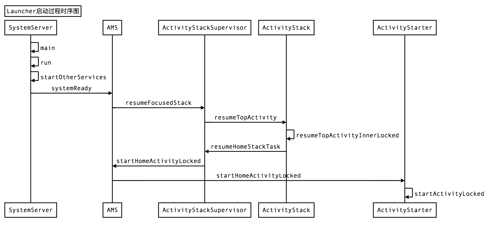

通过层层调用，最终调用到startActivityStarter方法中，剩下的就跟普通的Activity的调用类似了，最终会调用到Launcher的onCreate方法中。

Launcher是如何显示应用图标的？

```Java
protected void onCreate(...){
    ...
    LauncherAppState app = LauncherAppState.getInstance();
    ...
    mModel = app.setLauncher(this);
    ...
    mModel.startLoader(...);
}

LauncherModel setLauncher(Launcher this){
    getLocalProvider(mContext)。setLauncherProviderChangeListener(launcher);
    mModel.initialize(launcher);
    return mModel;
}

public void initialize(Callbacks callbacks){
    synchronized(mLock){
        ...
        // 把传入的Launcher封装成弱引用对象
        mCallbacks = new WeakReference<Callbacks>(callbacks);
    }
}

在LauncherModel中，创建了sWorkerThread
HandlerThread sWorkerThread = new HandlerThread("launcher-loader");
Handler sWorker = new Handler(sWorkerThread.getLooper());

public void startLoader(...){
    ...
    mLoaderTask = new LoaderTask(mApp, isLaunching);
    ...
    // 将LoaderTask作为消息传递给HandlerThread
    sWorker.post(mLoaderTask);
}

private class LoaderTask implements Runnable {
    ...
    // 加载工作区信息
    loadWorkspace();
    ...
    // 绑定工作区信息
    bindWorkspace(mPageToBindFirst);
    ...
    // 加载系统已经安装好的应用程序信息
    loadAllApps();
}

private void loadAllApps(){
    mHandler.post(new Runnable {
        ...
        // 这个callbacks实际指向就是Launcher
        callbacks.bindAllApplications(added);
    })
}

public void bindAllApplications(final ArrayList<AppInfo> apps){
    ...
    if(mAppViews != null){
        // mAppViews类型为AllAppsContainerView
        mAppViews.setApps(apps);
    }
}

最终会调用到AllAppsContainerView的onFinishInflate方法中
protected void onFinishInflate() {
    ...
    mAppsRecyclerView.setApps(mApps);
    mAppsRecyclerView.setLayoutManager(...);
    mAppsRecyclerView.setAdapter(...);
}

现在应用程序的快捷图标的列表就显示在屏幕上了。

```

### 1.2.1. 总结：Android的启动流程

- **启动电源以及系统启动**
- **引导程序BootLoader**
- **Linux内核启动**
- **init进程启动**
- **Zygote进程启动**
- **SystemServer进程启动**
- **Launcher启动**

# 2. Android如何打包一个APK？

新版本的apk打包流程图
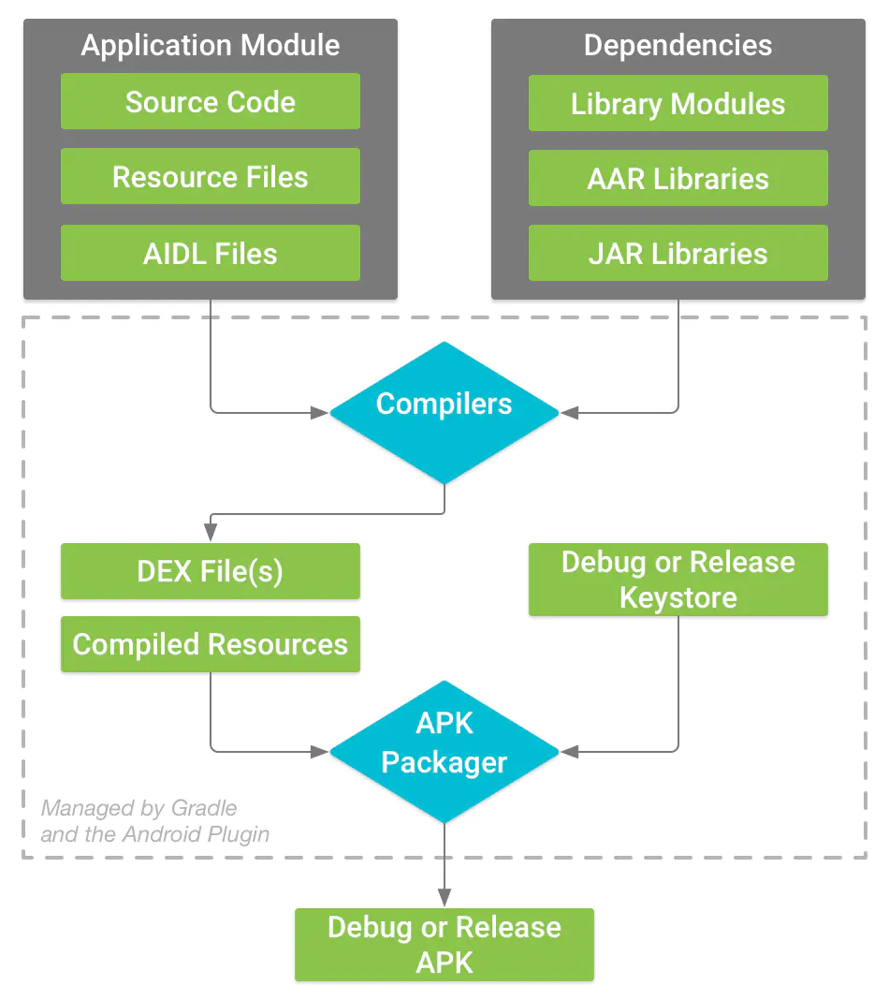

旧版本的apk打包流程图
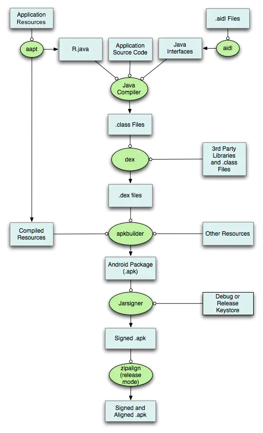

## 2.1. Resource资源文件

包括res目录下的xml文件、动画、drawable图片、音视频等。
AAPT工具负责编译项目中的这些资源文件，所有资源文件被编译处理，XML文件（drawable图片除外）会被编译成二进制文件，所以解压apk后无法打开xml文件。assets和raw目录下的资源并不会被编译，直接打包都apk压缩包中。
资源文件编译后包括两部分：resources.arsc 和 R.java。
resources.arsc 保存资源索引的一个列表，简单的可以理解为map<key,value>,其中key就是R.java中定义的资源ID，value就是资源所在路径。
R.java 定义了各个资源的ID常量
两者结合在一起就能找到对应的资源引用。

## 2.2. 源码部分

源码(.aidl会编译成.java文件) -> xxx.class + 依赖的三方库.class -> dx工具优化 -> .dex文件。

## 2.3. 打包阶段

使用ApkBuilder将编译后的resource和.dex文件 -> apk ，实际上apk中还有其他资源，AndroidManifest.xml和三方库中的.so文件。

创建好的apk -> jarsigner 签名 -> 签名后生成META_INF文件夹，此文件夹中保存着跟签名相关的各个文件。

- CERT.SF 生成每个文件相对的密钥
- MANIFEST.MF 数字签名信息
- xxx.SF 这是JAR文件的签名文件
- xxx.DSA 对输出文件的签名和公钥
  
## 2.4. 优化

使用zipAlign 对apk中未压缩的资源文件(图片、视频等)进行对齐操作，让资源按照4字节的边界进行对齐。目的是为了加快资源的访问速度。

# 3. Android 的Handler机制

> Handler是Android消息机制的上层接口，Handler的运行需要底层的MessageQueue和Looper的支撑。

MessageQueue 采用单链表的数据结构来存储消息列表，称为消息队列，它按照Message的时间when来进行排序，是个有序队列。MessageQueue这是一个消息存储单元，不能去处理消息，这就需要Looper来实现了。Looper会以无限循环的方式查看队列中是否有新消息，有的话就去处理，没有的话就等待。

Handler的主要作用就是将一个任务切换到指定线程中去执行。Android规定UI只能在主线程进行，通过ViewRootImpl对UI操作进行了验证，通过ViewRootImpl的checkThread 方法来完成。

Android的UI控件不是线程安全的，采用锁机制会降低UI访问效率，阻塞线程的行为，所以采用单线程模型来处理UI操作。

一个线程可以有多个Handler，每个Handler只有一个Looper，一个Looper只有一个MessageQueue。

``` Java
final Looper mLooper;
final MessageQueue mQueue;

public Handler() {
    this(null , false);
}

public Handler(Callback callback, boolean async){

        ...
        mLooper = Looper.myLooper();
        if (mLooper == null) {
            throw new RuntimeException(
                "Can't create handler inside thread " + Thread.currentThread()
                        + " that has not called Looper.prepare()");
        }
        mQueue = mLooper.mQueue;
        mCallback = callback;
        mAsynchronous = async;
}

static final ThreadLocal<Looper> sThreadLocal = new ThreadLocal<Looper>();

public static @Nullable Looper myLooper() {
    return sThreadLocal.get();
}

```

Handler中使用的Looper是通过ThreadLocal获取当前线程的Looper对象。TheadLocal可以在不同线程中互不干扰的存储并提供数据。线程默认是没有Looper的，所以如果使用Handler就必须为线程创建Looper。而我们常说的主线程就是ActivityThread，在ActivityThread的main方法中通过Looper.prepareMainLooper()初始化Looper对象以及Looper.loop()来开启无限循环，所以主线程默认可以使用Handler。

``` Java
public static void prepareMainLooper () {
    prepare(false);
    synchronized(Looper.class){
        if(sMainLooper != null){
            // 主线程的Looper已经创建了
            throw new IllegalStateException("The main Looper has already been prepared.");
        }
        sMainLooper = myLooper();
    }
}

private static void prepare(boolean quitAllowed) {
    if (sThreadLocal.get() != null) {
        // 一个线程只能创建一个Looper
        throw new RuntimeException("Only one Looper may be created per thread");
    }
    // 新创建的Looper设置到了线程本地变量sThreadLocal中
    sThreadLocal.set(new Looper(quitAllowed));
}

private Looper(boolean quitAllowed) {
    mQueue = new MessageQueue(quitAllowed);
    mThread = Thread.currentThread();
}

MessageQueue(boolean quitAllowed) {
    mQuitAllowed = quitAllowed;
    // 注意MessageQueue的真正实现是Native层，nativeInit函数在Native层创建了一个与MessageQueue对应的NativeMessageQueue对象
    mPtr = nativeInit();
}

public static @Nullable Looper myLooper() {
    return sThreadLocal.get();
}

public static void loop() {
    ...
    for(;;){
        Message msg = queue.next();
        if(msg == null){
            return;
        }

        try{
            // 这个msg.target就是Handler
            msg.target.dispatchMessage(msg);
            ...
        } finally {
            ...
        }
    }
}

public void dispatchMessage( Message msg) {
    if(msg.callback != null){
        // 通过post(Runnable)发送的消息会执行到这里
        handleCallback(msg);
    } else {
        // 通过sendMessage发送的消息执行到这里
        if(mCallback != null){
            if(mCallback.handleMessage(msg)) {
                return;
            }
        }
        handleMessage(msg);
    }
}

// 这个空方法是我们再创建Handler是要覆盖的方法
public void handleMessage (Message msg) {}

```

## 3.1. Handler的 sendMessage 系列方法

sendMessage/sendMessageDelayed/sendMessageAtTime
最终会调到sendMessageAtTime的enqueueMessage()中。

``` Java

private boolean enqueueMessage(@NonNull MessageQueue queue, @NonNull Message msg,
        long uptimeMillis) {
    // 把handler赋值给msg.target
    msg.target = this;
    msg.workSourceUid = ThreadLocalWorkSource.getUid();

    if (mAsynchronous) {
        msg.setAsynchronous(true);
    }
    return queue.enqueueMessage(msg, uptimeMillis);
}

boolean enqueueMessage(Message msg, long when) {
    if (msg.target == null) {
        throw new IllegalArgumentException("Message must have a target.");
    }

    synchronized (this) {
        if (msg.isInUse()) {
            throw new IllegalStateException(msg + " This message is already in use.");
        }

        if (mQuitting) {
            IllegalStateException e = new IllegalStateException(
                    msg.target + " sending message to a Handler on a dead thread");
            Log.w(TAG, e.getMessage(), e);
            msg.recycle();
            return false;
        }

        msg.markInUse();
        msg.when = when;
        Message p = mMessages;
        boolean needWake;
        // 根据时间进行排序
        if (p == null || when == 0 || when < p.when) {
            // New head, wake up the event queue if blocked.
            msg.next = p;
            mMessages = msg;
            needWake = mBlocked;
        } else {
           
            needWake = mBlocked && p.target == null && msg.isAsynchronous();
            Message prev;
            for (;;) {
                prev = p;
                p = p.next;
                if (p == null || when < p.when) {
                    break;
                }
                if (needWake && p.isAsynchronous()) {
                    needWake = false;
                }
            }
            msg.next = p; // invariant: p == prev.next
            prev.next = msg;
        }

        // We can assume mPtr != 0 because mQuitting is false.
        if (needWake) {
            // 调用Native层代码，添加消息时可能在阻塞状态
            nativeWake(mPtr);
        }
    }
    return true;
}

```

## 3.2. Handler 的post(Runnable) 与 sendMessage 有什么区别？

``` Java

public final boolean post(@NonNull Runnable r) {
    return  sendMessageDelayed(getPostMessage(r), 0);
}

private static Message getPostMessage(Runnable r) {
    Message m = Message.obtain();
    m.callback = r;
    return m;
}

```

post(Runnable)会将Runnable赋值到Message的callback变量中，这个Runnable会在Looper从MessageQueue中取出Message后，调用dispatchMessage的时候处理。

## 3.3. Handler的sendMessageDelayed 或者 postDelayed 是如何实现的？

消息延时处理的核心就是在获取Message的阶段。

``` Java

Message next() {
    
    ...
    int nextPollTimeoutMillis = 0;
    for (;;) {
        if (nextPollTimeoutMillis != 0) {
            Binder.flushPendingCommands();
        }

        // 消息队列若为空，取消息时也可能在阻塞状态
        nativePollOnce(ptr, nextPollTimeoutMillis);

        synchronized (this) {
            ...
            if (msg != null) {
                //  当前时间小于消息触发时间，计算一个timeout
                if (now < msg.when) {
                    // Next message is not ready.  Set a timeout to wake up when it is ready.
                    nextPollTimeoutMillis = (int) Math.min(msg.when - now, Integer.MAX_VALUE);
                } else {
                    // Got a message.
                    mBlocked = false;
                    if (prevMsg != null) {
                        prevMsg.next = msg.next;
                    } else {
                        mMessages = msg.next;
                    }
                    msg.next = null;
                    if (DEBUG) Log.v(TAG, "Returning message: " + msg);
                    msg.markInUse();
                    return msg;
                }
            } else {
                // No more messages.
                nextPollTimeoutMillis = -1;
            }
        ...
        nextPollTimeoutMillis = 0;
    }
}

```

> 延迟消息的执行时间不是准确的

## 3.4. Looper.loop() 为什么不会阻塞主线程？

先来看一下MessageQueue.java中定义的native层方法都有哪些？

``` Java

private native static long nativeInit();
private native static void nativeDestroy(long ptr);
@UnsupportedAppUsage
private native void nativePollOnce(long ptr, int timeoutMillis); /*non-static for callbacks*/
private native static void nativeWake(long ptr);
private native static boolean nativeIsPolling(long ptr);
private native static void nativeSetFileDescriptorEvents(long ptr, int fd, int events);

```

``` Java 

// Java层的next方法
Message next() {
    
    ...
    int nextPollTimeoutMillis = 0;
    for (;;) {
        if (nextPollTimeoutMillis != 0) {
            Binder.flushPendingCommands();
        }

        // 调用Native层的方法
        nativePollOnce(ptr, nextPollTimeoutMillis);
    }
    ...
}
```

上面MessageQueue.java 的构造方法中，调用了NativeInt方法。

```Java
MessageQueue(boolean quitAllowed) {
    mQuitAllowed = quitAllowed;
    mPtr = nativeInit();
}
```

``` C++

android_os_MessageQueue.cpp

// 这是NativeInt方法在Native层的实现
static jlong android_os_MessageQueue_nativeInit(JNIEnv* env, jclass clazz) {
    // NativeMessageQueue是MessageQueue在Native层的代表
    NativeMessageQueue* nativeMessageQueue = new NativeMessageQueue();
    if (!nativeMessageQueue) {
        jniThrowRuntimeException(env, "Unable to allocate native queue");
        return 0;
    }

    nativeMessageQueue->incStrong(env);
    // 将这个NativeMessageQueue的指针给Java层
    return reinterpret_cast<jlong>(nativeMessageQueue);
}

// NativeMessageQueue中生成了Looper对象
> 注意这是Native层Looper，它几乎重写了Java层的Looper逻辑
NativeMessageQueue::NativeMessageQueue() :
        mPollEnv(NULL), mPollObj(NULL), mExceptionObj(NULL) {
    mLooper = Looper::getForThread();
    if (mLooper == NULL) {
        mLooper = new Looper(false);
        Looper::setForThread(mLooper);
    }
}

// Looper里创建了epoll，注册了事件
Looper::Looper(bool allowNonCallbacks) :
        mAllowNonCallbacks(allowNonCallbacks), mSendingMessage(false),
        mPolling(false), mEpollFd(-1), mEpollRebuildRequired(false),
        mNextRequestSeq(0), mResponseIndex(0), mNextMessageUptime(LLONG_MAX) {
    // 使用这个函数来创建一个事件对象，该函数返回一个文件描述符来代表这个事件对象，之后我们就用这个来调用对象
    mWakeEventFd = eventfd(0, EFD_NONBLOCK | EFD_CLOEXEC);
    LOG_ALWAYS_FATAL_IF(mWakeEventFd < 0, "Could not make wake event fd: %s",
                        strerror(errno));

    AutoMutex _l(mLock);
    // 重建epoll事件
    rebuildEpollLocked();
}

// TLS，线程本地存储，可以理解为Java端的ThreadLocal
// 将创建好的Looper保存到TLS中。
void Looper::setForThread(const sp<Looper>& looper) {
    sp<Looper> old = getForThread(); // also has side-effect of initializing TLS

    if (looper != NULL) {
        looper->incStrong((void*)threadDestructor);
    }

    pthread_setspecific(gTLSKey, looper.get());

    if (old != NULL) {
        old->decStrong((void*)threadDestructor);
    }
}

// Java层的Looper的loop()死循环中，调用MessageQueue.java的next()方法，next()方法调用nativePollOnce
static void android_os_MessageQueue_nativePollOnce(JNIEnv* env, jobject obj,
        jlong ptr, jint timeoutMillis) {
    NativeMessageQueue* nativeMessageQueue = reinterpret_cast<NativeMessageQueue*>(ptr);
    nativeMessageQueue->pollOnce(env, obj, timeoutMillis);
}

// MessageQueue.cpp 
void NativeMessageQueue::pollOnce(JNIEnv* env, jobject pollObj, int timeoutMillis) {
    mPollEnv = env;
    mPollObj = pollObj;
    mLooper->pollOnce(timeoutMillis);
    mPollObj = NULL;
    mPollEnv = NULL;

    if (mExceptionObj) {
        env->Throw(mExceptionObj);
        env->DeleteLocalRef(mExceptionObj);
        mExceptionObj = NULL;
    }
}

// Looper.cpp
int Looper::pollOnce(int timeoutMillis, int* outFd, int* outEvents, void** outData) {
    int result = 0;
    for (;;) {
        ...
        // timeoutMillis就是Java层设置的超时时间
        result = pollInner(timeoutMillis);
    }
}

// Looper.cpp
int Looper::pollInner(int timeoutMillis) {

    ...
    // Poll.
    int result = POLL_WAKE;

    ...
    // 关键方法，这个方法会等待事情发生或者超时
    // 在nativeWake方法向管道写端写入字符时，该方法会返回，否则一直阻塞
    int eventCount = epoll_wait(mEpollFd, eventItems, EPOLL_MAX_EVENTS, timeoutMillis);
    
    ...
    //从epoll_wait()里唤醒了，读取管道内容
    awoken();
            
    ...
    return result;
}

// 从管道里读取内容，已经拿到Native层的Message了
void Looper::awoken() {
#if DEBUG_POLL_AND_WAKE
    ALOGD("%p ~ awoken", this);
#endif

    uint64_t counter;
    TEMP_FAILURE_RETRY(read(mWakeEventFd, &counter, sizeof(uint64_t)));
}

// nativeWake()方法在MessageQueue.java的enqueueMessage()中被调用
android_os_MessageQueue.cpp

 static void android_os_MessageQueue_nativeWake(JNIEnv* env, jclass clazz, jlong ptr) {
    NativeMessageQueue* nativeMessageQueue = reinterpret_cast<NativeMessageQueue*>(ptr);
    nativeMessageQueue->wake();
}

void NativeMessageQueue::wake() {
    mLooper->wake();
}

// Looper.cpp
// 如何唤醒的呢？
// 通过调用write()向管道写入一个整数1，TEMP_FAILURE_RETRY就是失败不断的重试，直到成功唤醒为止，
// 成功写入后，管道的另一端就会接收到，并从阻塞状态结束，即从epoll_wait()返回，执行后面代码

void Looper::wake() {
#if DEBUG_POLL_AND_WAKE
    ALOGD("%p ~ wake", this);
#endif

    uint64_t inc = 1;
    ssize_t nWrite = TEMP_FAILURE_RETRY(write(mWakeEventFd, &inc, sizeof(uint64_t)));
    if (nWrite != sizeof(uint64_t)) {
        if (errno != EAGAIN) {
            LOG_ALWAYS_FATAL("Could not write wake signal to fd %d: %s",
                    mWakeEventFd, strerror(errno));
        }
    }
}

```

在enqueueMessage() 和 next()方法执行时可能会发生阻塞，但是没有发生ANR，原因就在于两个native方法，nativeWake 和 nativePollOnce。
它的本质就是Linux的管道。管道，其本质是也是文件，但又和普通的文件会有所不同：管道缓冲区大小一般为1页，即4K字节。管道分为读端和写端，读端负责从管道拿数据，当数据为空时则阻塞；写端向管道写数据，当管道缓存区满时则阻塞。

当调用nativePollOnce方法时，主线程会释放CPU资源进入休眠状态，知道下调消息到达或者有事务发生，通过往pipe管道写端写入数据来唤醒主线程工作，采用epoll机制。

写了这么多，参考下面这张图来看一下过程
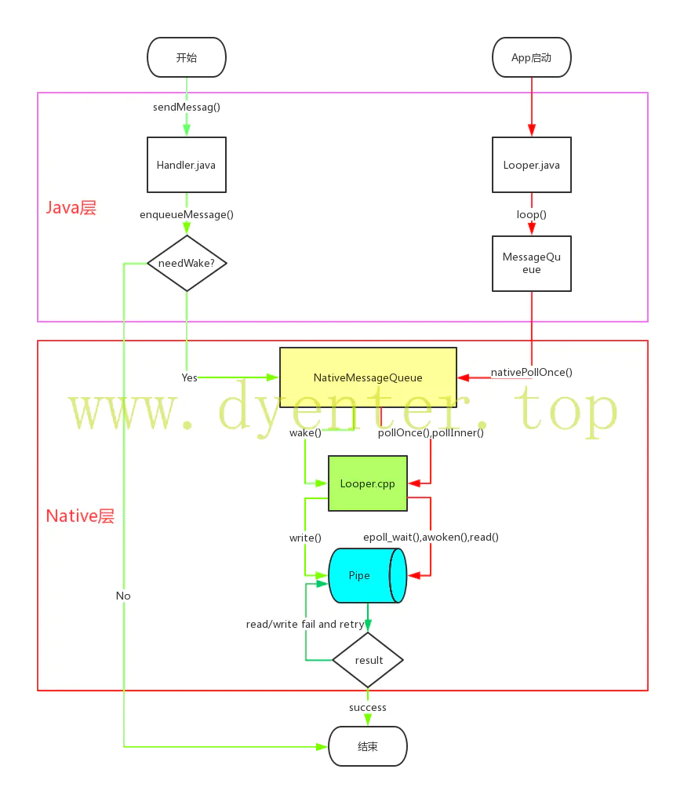

> 注意在子线程中创建了Looper后，在所有事情都完成以后应该调用quit方法来终止消息循环，否则这个子线程就会一直等待(阻塞)状态。退出Looper后线程就会终止，所以在不需要的时候要及时终止Looper。

# 4. Android 事件产生、分发机制？

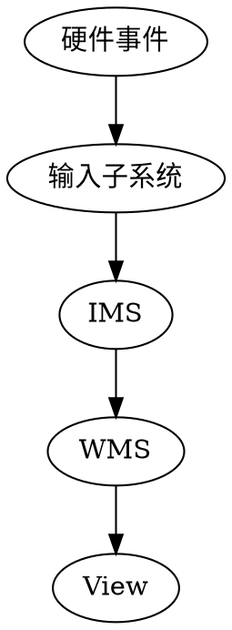
输入事件传递流程：输入系统部分（InputManagerService）、WMS处理部分和View处理部分。

## 4.1. 输入系统部分：
参考：https://sharrychoo.github.io/blog/android-source/ims-launch
Android提供了getevent和sendevent两个工具从设备节点读取输入事件和写入输入事件。
InputManagerService就是监听/dev/input下所有的设备节点，当设备节点有数据时会将数据进行加工处理并找到合适的窗口，将输入事件派发给它。

> IMS 的启动可以分为 构建过程和启动过程
### 4.1.1. IMS的构造：（同Handler消息队列思想一致）

``` Java
public class InputManagerService extends IInputManager.Stub
        implements Watchdog.Monitor {
            
    public InputManagerService(Context context) {
        this.mContext = context;
        // 1. 构建 DisplayThread 线程 Looper 的 handler
        this.mHandler = new InputManagerHandler(DisplayThread.get().getLooper());
        ......
        // 2. 初始化 Native 层
        mPtr = nativeInit(this, mContext, mHandler.getLooper().getQueue());
        ......
    }
    
    private static native long nativeInit(InputManagerService service,
            Context context, MessageQueue messageQueue);
            
}
```
IMS 构造函数中主要完成：
- 构建DisplayThread线程Looper的handler
- 调用nativeInit，进行native层的初始化操作
  
在nativeInit中，获取当前线程的MessageQueue，然后构造一个与Java层对应的NativeInputManagerduixiang 
``` C++
// frameworks/base/services/core/jni/com_android_server_input_InputManagerService.cpp
NativeInputManager::NativeInputManager(jobject contextObj,
        jobject serviceObj, const sp<Looper>& looper) :
        mLooper(looper), mInteractive(true) {
    JNIEnv* env = jniEnv();

    mContextObj = env->NewGlobalRef(contextObj);
    mServiceObj = env->NewGlobalRef(serviceObj);
    ......
    // 创建了一个 EventHub
    sp<EventHub> eventHub = new EventHub();
    // 创建了 InputManager 对象
    mInputManager = new InputManager(eventHub, this, this);
}
```
#### 4.1.1.1. EventHub的创建
```C++
// frameworks/native/services/inputflinger/EventHub.cpp
EventHub::EventHub(void) :
        mBuiltInKeyboardId(NO_BUILT_IN_KEYBOARD), mNextDeviceId(1), mControllerNumbers(),
        mOpeningDevices(0), mClosingDevices(0),
        mNeedToSendFinishedDeviceScan(false),
        mNeedToReopenDevices(false), mNeedToScanDevices(true),
        mPendingEventCount(0), mPendingEventIndex(0), mPendingINotify(false) {
    ......
    // 1. 创建了一个 Epoll, 用于监听 mINotifyFd 和 mWakeReadPipeFd 中的数据
    mEpollFd = epoll_create(EPOLL_SIZE_HINT);
    ......
    // 2. Epoll 监听 input 驱动设备文件的监听者
    // 2.1 创建输入驱动设备文件路径的监听者 mINotifyFd
    mINotifyFd = inotify_init()
    // DEVICE_PATH 为 "/dev/input" 表示监听输入驱动设备文件
    int result = inotify_add_watch(mINotifyFd, DEVICE_PATH, IN_DELETE | IN_CREATE);
    ......
    // 2.3 调用 epoll 文件的 ctl 系统调用, 监听 mINotifyFd 文件描述符
    result = epoll_ctl(mEpollFd, EPOLL_CTL_ADD, mINotifyFd, &eventItem);
    ......
    // 3. 创建管道
    int wakeFds[2];
    result = pipe(wakeFds);
    // 记录读端
    mWakeReadPipeFd = wakeFds[0];
    // 记录写端
    mWakeWritePipeFd = wakeFds[1];
    // 将管道的读写两端设置为非阻塞的模式
    result = fcntl(mWakeReadPipeFd, F_SETFL, O_NONBLOCK);
    result = fcntl(mWakeWritePipeFd, F_SETFL, O_NONBLOCK);
    ......
    // 4. Epoll 监听管道的读端 mWakeReadPipeFd 的数据变化
    eventItem.data.u32 = EPOLL_ID_WAKE;
    result = epoll_ctl(mEpollFd, EPOLL_CTL_ADD, mWakeReadPipeFd, &eventItem);
    ......
}
```
EventHub主要做了如下操作：
- 创建用于IO多路复用对象Epoll
- Epoll监听mINotifyFd
  - 创建输入驱动设备文件的坚挺着mINotifyFd
  - Epoll监听mINotifyFd
- 创建非阻塞读写的管道
- Epoll监听管道的读端文件描述符

#### 4.1.1.2. InputManager的创建

```C++
// frameworks/native/services/inputflinger/InputManager.cpp
InputManager::InputManager(
        const sp<EventHubInterface>& eventHub,
        const sp<InputReaderPolicyInterface>& readerPolicy,
        const sp<InputDispatcherPolicyInterface>& dispatcherPolicy) {
    // 创建 InputDispatcher,输入流的分发者
    mDispatcher = new InputDispatcher(dispatcherPolicy);
    // 创建 InputReader,输入流的读取者
    mReader = new InputReader(eventHub, readerPolicy, mDispatcher);
    // 3. 执行初始化操作
    initialize();
}

void InputManager::initialize() {
    // 创建读取输入流的线程
    mReaderThread = new InputReaderThread(mReader);
    // 创建分发输入流的线程
    mDispatcherThread = new InputDispatcherThread(mDispatcher);
}

```

InputManager构造函数中，创建了四个对象：
- InputDispatcher : 输入流的分发者
- InputReader : 输入流的读取者
    - 在InputReader中持有一个事件队列QueuedInputListener,用于存储接收的事件，并且通知InputDispatcher进行后续的分发操作
- InputReaderThread : 输入流的读取线程
- InputDispatcherThread : 输入流的分发线程

InputManager整个事件的读取和分发使用的是 生产者-消费者 模型。

### 4.1.2. IMS的构造总结

- 在Java层创建一个DisplayThread消息队列的Handler
- 将DisplayThread的MessageQueue传入Native层，执行Native层IMS的初始化操作
- Native层创建了一个与Java层InputManagerService对应的NativeInputManager对象
  - 创建EventHub，监听输入设备驱动的事件流变化
    - 创建用于IO多路复用对象Epoll
    - Epoll监听mINotifyFd文件描述符，进而监听输入设备集合（Android手机支持连接多个输入设备）
      - 创建输入驱动设备文件的监听者mINotifyFd
      - Epoll监听mINotifyFd
    - 创建非阻塞读写管道
    - Epoll监听管道的读端文件描述符
  - 创建InputManager来读取和分发事件序列
    - 创建线程InputReaderThread
      - 使用InputRead读取输入设备产生事件到QueuedInputListener
    - 创建线程InputDispatcherThread
      - 使用InputDispatcher分发数据

### 4.1.3. IMS的启动

#### 4.1.3.1. 事件生产线程工作机制

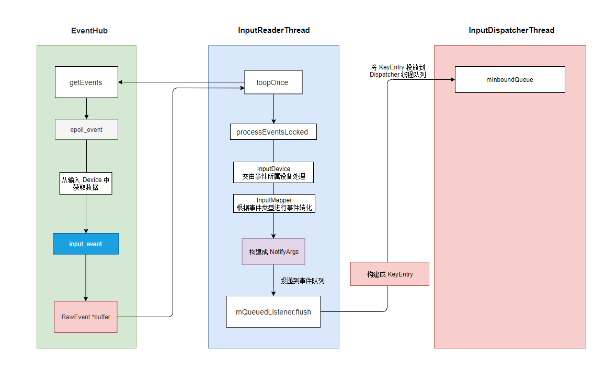

InputReadThread启动之后会不断的调用InputReader的loopOnce来读取输入事件：
-  调用EventHub的getEvents来获取输入事件流，写入mEventBuffer数组
   -  使用epoll阻塞式的获取epoll_event事件
   -  使用epoll_event获取具体的输入设备
   -  从输入设备中读取事件序列input_event存到RawEvent数据中并返回给上层
- 调用ProcessEventsLocked处理事件
  - 调用InputDevice的process处理该设备产生的事件
  - 调用InputMapper，将抽象的RawEvent事件映射程具体的事件类型
    - 映射完毕后，使用NotifyArgs描述
  - 将NotifyArgs投入QueuedInputListener队列
- 调用QueuedInputListener的flush函数
  - 通知InputDispatcher.notify消费事件
  - 将NotifyArgs构建成KeyEvent添加到InputDispatcher的mInboundQueue队列
  - 唤醒InputDispatcherThread执行事件分发

整个流程：
```
    epoll_event -> input_event -> RawEvent -> NotifyArgs -> KeyEntry
```

#### 4.1.3.2. 事件分发线程工作机制

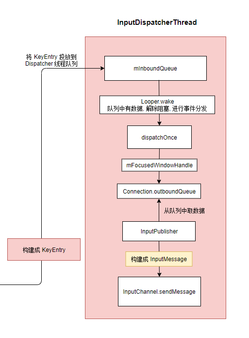

InputDispatchThread启动之后不断的调用InputDispatcher的dispatchOnce来执行事件分发：
- 从mInboundQueue中获取队列首事件KeyEntry保存到MPendingEvent进行分发处理
- 找寻事件的相应窗体保存到inputTargets集合
  - 找寻焦点窗体mFocusedWindowHandle，将它的数据注入inputTarget
- 遍历inputTargets集合进行事件分发
  - 获取响应者连接Connection
  - 将KeyEvent构建成了DispatchEntry对象，添加到Connection的outboundQueue队列中
  - Connection内部的inputPublisher获取队列中的元素进行发布
  - 将KeyEvent构建成InputMessage，通过inputChannel.sendMessage发布

整个流程：
```
    KeyEntry -> DispatchEntry -> InputMessage
```

#### 4.1.3.3. IMS的启动流程

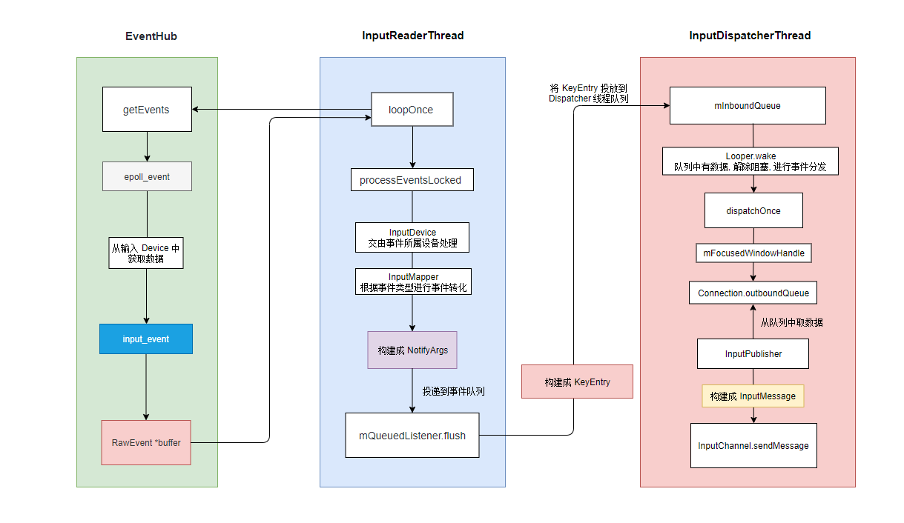

## 4.2. IMS的事件分发

ViewRootImpl会通过WindowManagerSession向WMS发起请求创建一个窗体，对应的实现如下：
``` Java
public class WindowManagerService extends IWindowManager.Stub {

    final WindowManagerPolicy mPolicy;// 在 WMS 的构造函数中赋值, 其实例为 PhoneWindowManager
    final WindowHashMap mWindowMap = new WindowHashMap();

    public int addWindow(Session session, IWindow client, int seq,
            LayoutParams attrs, int viewVisibility, int displayId, Rect outFrame,
            Rect outContentInsets, Rect outStableInsets, Rect outOutsets,
            DisplayCutout.ParcelableWrapper outDisplayCutout, InputChannel outInputChannel) {
            
        .......
        synchronized(mWindowMap) {
            ......
            // 1. 创建一个窗体的描述
            final WindowState win = new WindowState(this, session, client, token, parentWindow,
                    appOp[0], seq, attrs, viewVisibility, session.mUid,
                    session.mCanAddInternalSystemWindow);
            ......
            // 2. 给这个窗体描述打开一个输入通道, 用于接收屏幕的点击事件(事件分发)
            final boolean openInputChannels = (outInputChannel != null && (attrs.inputFeatures & INPUT_FEATURE_NO_INPUT_CHANNEL) == 0);
            if  (openInputChannels) {
                win.openInputChannel(outInputChannel);
            }
            ......
            // 3. 将新创建添加的 WindowState 设置为 IMS 的焦点 Window, 即 native 层的 mFocusedWindowHandle
            if (win.canReceiveKeys()) {
                focusChanged = updateFocusedWindowLocked(UPDATE_FOCUS_WILL_ASSIGN_LAYERS,
                        false /*updateInputWindows*/);
                ......
            }
            .......
        }
        ......
        return res;
    }
}
```
WMS 添加一个Window的过程：
- 创建窗体描述WindowState
- 打开窗体的输入通道InputChannel
- 更新IMS的焦点窗体
  - native层的mFocusedWindowHandle

那么IMS是如何将事件分发到窗体上openInputChannel输入通道的呢？

### 4.2.1. 创建InputChannel通道组

```Java 
class WindowState extends WindowContainer<WindowState> implements WindowManagerPolicy.WindowState {
   
    // Input channel and input window handle used by the input dispatcher.
    // 与IMS的inputDispatcher关联上了
    final InputWindowHandle mInputWindowHandle;
    InputChannel mInputChannel;
    private InputChannel mClientChannel;
    
     WindowState(WindowManagerService service, Session s, IWindow c, WindowToken token,
            WindowState parentWindow, int appOp, int seq, WindowManager.LayoutParams a,
            int viewVisibility, int ownerId, boolean ownerCanAddInternalSystemWindow,
            PowerManagerWrapper powerManagerWrapper) {
        ......
        // 描述当前 WindowState 的句柄值
        mInputWindowHandle = new InputWindowHandle(
                mAppToken != null ? mAppToken.mInputApplicationHandle : null, this, c,
                    getDisplayId());
    }
    
    void openInputChannel(InputChannel outInputChannel) {
        ......
        // 1. 创建一个 InputChannel 组
        String name = getName();
        InputChannel[] inputChannels = InputChannel.openInputChannelPair(name);
        // 2. 一个通道保存在当前 WindowState 中
        mInputChannel = inputChannels[0];
        // 2.1 保存到 WindowState 句柄值中
        mInputWindowHandle.inputChannel = inputChannels[0];
        // 3. 一个通道用于给对应的应用进程使用
        mClientChannel = inputChannels[1];
        if (outInputChannel != null) {
            // 3.1 将客户端的通道拷贝到 outInputChannel 对象中, 以便通过 Binder 驱动返回给客户端
            mClientChannel.transferTo(outInputChannel);
            mClientChannel.dispose();
            mClientChannel = null;
        } else {
            ......
        }
        // 4. 向 InputManager 注册这个窗体的输入通道
        mService.mInputManager.registerInputChannel(mInputChannel, mInputWindowHandle);
    }
    
}
```
窗体通道的注册如下：
- **调用InputChannel.openInputChannelPair获取一个输入通道组**
- inputChannel[0]保存在WindowState的句柄值中 mInputWindowHandle
- inputChannel[1]通过Binder驱动返回给客户端
- **向IMS的InputManager注册这个窗体的输入通道**

### 4.2.2. InputChannel是如何创建的？

``` Java 
public final class InputChannel implements Parcelable {
    
    public static InputChannel[] openInputChannelPair(String name) {
        ......
        // 调用Native层
        return nativeOpenInputChannelPair(name);
    }
    
    private static native InputChannel[] nativeOpenInputChannelPair(String name);

}
```

``` C++
// frameworks/base/core/jni/android_view_InputChannel.cpp
static jobjectArray android_view_InputChannel_nativeOpenInputChannelPair(JNIEnv* env,
        jclass clazz, jstring nameObj) {
    // 1. 获取 name
    const char* nameChars = env->GetStringUTFChars(nameObj, NULL);
    std::string name = nameChars;
    env->ReleaseStringUTFChars(nameObj, nameChars);
    
    sp<InputChannel> serverChannel;
    sp<InputChannel> clientChannel;
    // 2. 调用了 InputChannel 的 openInputChannelPair 创建两个 InputChannel
    status_t result = InputChannel::openInputChannelPair(name, serverChannel, clientChannel);
    ......
    // 3. 通过 JNI 创建一个 InputChannel 数组, 将 serverChannelObj 保存
    jobjectArray channelPair = env->NewObjectArray(2, gInputChannelClassInfo.clazz, NULL);
    ......
    env->SetObjectArrayElement(channelPair, 0, serverChannelObj);
    env->SetObjectArrayElement(channelPair, 1, clientChannelObj);
    return channelPair;
}
```

``` C++
// frameworks/native/libs/input/InputTransport.cpp
static const size_t SOCKET_BUFFER_SIZE = 32 * 1024;

status_t InputChannel::openInputChannelPair(const std::string& name,
        sp<InputChannel>& outServerChannel, sp<InputChannel>& outClientChannel) {
    int sockets[2];
    // 1. 创建一个 Socket
    if (socketpair(AF_UNIX, SOCK_SEQPACKET, 0, sockets)) {
        ......
        return result;
    }
    // 2. 配置 Socket 端口数据
    // Socket 传输数据大小为 32 KB
    int bufferSize = SOCKET_BUFFER_SIZE;
    // 2.1 配置服务端端口
    setsockopt(sockets[0], SOL_SOCKET, SO_SNDBUF, &bufferSize, sizeof(bufferSize));
    setsockopt(sockets[0], SOL_SOCKET, SO_RCVBUF, &bufferSize, sizeof(bufferSize));
    // 2.2 配置客户端端口
    setsockopt(sockets[1], SOL_SOCKET, SO_SNDBUF, &bufferSize, sizeof(bufferSize));
    setsockopt(sockets[1], SOL_SOCKET, SO_RCVBUF, &bufferSize, sizeof(bufferSize));

    // 3. 创建 InputChannel
    // 3.1 创建服务端的 InputChannel
    std::string serverChannelName = name;
    serverChannelName += " (server)";
    outServerChannel = new InputChannel(serverChannelName, sockets[0]);

    // 3.2 创建客户端的 InputChannel
    std::string clientChannelName = name;
    clientChannelName += " (client)";
    outClientChannel = new InputChannel(clientChannelName, sockets[1]);
    return OK;
}
```
可以看出来，服务端的IMS与应用进程的交互是通过Socket进行跨进程通信的。
最后，看一下InputChannel的构造过程：

``` C++
// frameworks/native/libs/input/InputTransport.cpp
InputChannel::InputChannel(const std::string& name, int fd) :
        mName(name), 
        // 保存 socket 端口的文件描述符
        mFd(fd) {
    ......
    // O_NONBLOCK 意为设置为非阻塞式 Socket 通信
    int result = fcntl(mFd, F_SETFL, O_NONBLOCK);
    ......
}
```
至此，InputChannel就创建好了，下面看一下IMS是如何注册InputChannel的？

### 4.2.3. IMS 注册InputChannel

```Java 
public class InputManagerService extends IInputManager.Stub
        implements Watchdog.Monitor {
    
    public void registerInputChannel(InputChannel inputChannel,
            InputWindowHandle inputWindowHandle) {
        // 调用了Native层的 nativeRegisterInputChannel
        nativeRegisterInputChannel(mPtr, inputChannel, inputWindowHandle, false);
    }
    
}
```

```C++
// frameworks/base/services/core/jni/com_android_server_input_InputManagerService.cpp
static void nativeRegisterInputChannel(JNIEnv* env, jclass /* clazz */,
        jlong ptr, jobject inputChannelObj, jobject inputWindowHandleObj, jboolean monitor) {
    
    // NativeInputManager 属于IMS
    NativeInputManager* im = reinterpret_cast<NativeInputManager*>(ptr);
    // 获取 InputChannel
    sp<InputChannel> inputChannel = android_view_InputChannel_getInputChannel(env,
            inputChannelObj);
    ......
    // 获取 WindowStateHandle
    sp<InputWindowHandle> inputWindowHandle =
            android_server_InputWindowHandle_getHandle(env, inputWindowHandleObj);
    // 调用了 InputManager 的 registerInputChannel 注册这个 WindowStateHandle 和 InputChannel
    status_t status = im->registerInputChannel(
            env, inputChannel, inputWindowHandle, monitor);
    ......
}

status_t NativeInputManager::registerInputChannel(JNIEnv* /* env */,
        const sp<InputChannel>& inputChannel,
        const sp<InputWindowHandle>& inputWindowHandle, bool monitor) {
    // 将注册操作转发到 InputManager.InputDispatcher 中, 注册新创建的WindowStateHandle 和 InputChannel
    return mInputManager->getDispatcher()->registerInputChannel(
            inputChannel, inputWindowHandle, monitor);
}
```

```C++
// frameworks/native/services/inputflinger/InputDispatcher.cpp
status_t InputDispatcher::registerInputChannel(const sp<InputChannel>& inputChannel,
        const sp<InputWindowHandle>& inputWindowHandle, bool monitor) {

    { // acquire lock
        AutoMutex _l(mLock);
        // 1. 创建一个 Connection 描述 IMS 和窗体的连接
        sp<Connection> connection = new Connection(inputChannel, inputWindowHandle, monitor);
        // 2. 将 InputChannel 的 socket 文件描述符, 添加到 mConnectionsByFd 中缓存
        int fd = inputChannel->getFd();
        mConnectionsByFd.add(fd, connection);
        // 3. 让 Looper 中的 epool 监听这个服务端的 socket 端口
        mLooper->addFd(fd, 0, ALOOPER_EVENT_INPUT, handleReceiveCallback, this);
    } // release lock
    // 4. 一个新 Window 添加进来了, 唤醒阻塞在 Looper.pollOnce 上的 InputDispatcherThread 线程
    mLooper->wake();
    return OK;
}
```
在注册InputChannel方法中，创建了一个描述 IMS 和 WindowState 连接的Connection 对象，让后让InputDispatcher的Looper去监听InputChannel中的Socket端口。

为什么要监听服务端的端口？
Socket与匿名管道不同，它支持双端读写，当应用进程读取了事件，消费之后是需要通知IMS所在系统服务进程，事件已经被消费了，这里的监听操作就是为了接受客户端的回执消息。

> InputChannel 是在WMS新建窗体时创建的(WindowState的openInputChannel中)，InputChannel的sendMessage是最终会发送给应用进程的socket端口

### 4.2.4. InputChannel的创建以及和WindowState向IMS注册过程
- 创建InputChannel输入通道组
  - 创建最大缓存为32kb的Socket
  - 服务端的 InputChannel 保留Socket 服务端的文件描述符
  - 客户端的 InputChannel 保留Socket 客户端的文件描述符
- 服务端新建的WindowState和InputChannel注册到IMS中
  - InputDispatcher将WindowState 和 InputChannel 封装到Connection中用于后续的事件分发


## 4.3. 应用进程是如何监听InputChannel的？

```Java
public final class ViewRootImpl implements ViewParent,
        View.AttachInfo.Callbacks, ThreadedRenderer.DrawCallbacks {
            
    InputChannel mInputChannel;
    
    public void setView(View view, WindowManager.LayoutParams attrs, View panelParentView) {
        synchronized (this) {
            if (mView == null) {
                // 这里是我们的请求布局
                requestLayout(); 
                // 1. 创建了一个 InputChannel 对象, 此时它是没有意义的
                if ((mWindowAttributes.inputFeatures
                        & WindowManager.LayoutParams.INPUT_FEATURE_NO_INPUT_CHANNEL) == 0) {
                    mInputChannel = new InputChannel();
                }
    
                try {
                    // 2. 调用 addToDisplay, 进而调用 WMS.addWindow 进行窗体添加操作
                    // mInputChannel 作为传出参数，此时就获取系统服务进程创建的inputChannel组的Native层的值
                    res = mWindowSession.addToDisplay(......, /*将 mInputChannel 传入*/mInputChannel);
                } catch (RemoteException e) {
                   ......
                } finally {
                   ......
                }
                ......
                // 3. WMS 的添加窗体完成后, mInputChannel 便通过 Binder 驱动拷贝 WMS 中传递过来的值
                if (mInputChannel != null) {
                    ......
                    // 3.1 创建了输入事件接收器
                    mInputEventReceiver = new WindowInputEventReceiver(mInputChannel,
                            Looper.myLooper());
                }
                ......
            }
        }
    }          
}
```
**InputChannel中持有的是Socket一端的文件描述符，而在linux系统中fd不是只在当前进程有效吗？在从系统服务进程传输到应用进程时不就无效了吗？
- 因为Binder驱动对fd的传输做了特殊处理，它不仅仅只是传递一个句柄int值，而是会在另一个进程找到一个空闲的句柄，然后让它指向对应的文件，因此客户端mInputChannel中的mFd与在系统服务进程中创建的InputChannel的mFd不一定相同，但是他们指向的确实同一个Socket端口文件。**

接下来，看一下输入事件接收器，WindowInputEventReceiver

### 4.3.1. 事件接收器初始化

```Java
public final class ViewRootImpl implements ViewParent,
        View.AttachInfo.Callbacks, ThreadedRenderer.DrawCallbacks {
        
    final class WindowInputEventReceiver extends InputEventReceiver {
        public WindowInputEventReceiver(InputChannel inputChannel, Looper looper) {
            super(inputChannel, looper);
        }
    }
    
}

public abstract class InputEventReceiver {

    private long mReceiverPtr;
    private InputChannel mInputChannel;
    private MessageQueue mMessageQueue;

    public InputEventReceiver(InputChannel inputChannel, Looper looper) {
        .......
        mInputChannel = inputChannel;
        // 这个 mMessageQueue 是主线程的消息队列
        mMessageQueue = looper.getQueue();
        // 执行 Native 初始化
        mReceiverPtr = nativeInit(new WeakReference<InputEventReceiver>(this),
                inputChannel, mMessageQueue);
    }
    
    private static native long nativeInit(WeakReference<InputEventReceiver> receiver,
            InputChannel inputChannel, MessageQueue messageQueue);
}
```

```C++
// frameworks/base/core/jni/android_view_InputEventReceiver.cpp
static jlong nativeInit(JNIEnv* env, jclass clazz, jobject receiverWeak,
        jobject inputChannelObj, jobject messageQueueObj) {
    // 1. 获取 Native 的 InputChannel
    sp<InputChannel> inputChannel = android_view_InputChannel_getInputChannel(env,
            inputChannelObj);
    // 2. 获取 MessageQueue 对应的 native 的对象
    sp<MessageQueue> messageQueue = android_os_MessageQueue_getMessageQueue(env, messageQueueObj);
    // 3. 创建了一个 native 的 NativeInputEventReceiver 对象, 用于监听 InputChannel 中的事件
    sp<NativeInputEventReceiver> receiver = new NativeInputEventReceiver(env,receiverWeak, inputChannel, messageQueue);
    // 3.1 初始化这个 receiver 对象
    receiver->initialize();
    ......
    // 将句柄返回给 Java 层
    return reinterpret_cast<jlong>(receiver.get());
}

```
Native层的处理如下：
- 先获取InputChannel和MessageQueue对应的native对象
- 创建一个NativeInputEventReceiver，
- 调用NativeInputReceiver.initialize对其初始化

```C++
// frameworks/base/core/jni/android_view_InputEventReceiver.cpp
NativeInputEventReceiver::NativeInputEventReceiver(JNIEnv* env,
        jobject receiverWeak, const sp<InputChannel>& inputChannel,
        const sp<MessageQueue>& messageQueue) :
        mReceiverWeakGlobal(env->NewGlobalRef(receiverWeak)),
        // 保存服务端传来的 InputChannel
        mInputConsumer(inputChannel),
        // 保存主线程的 MessageQueue
        mMessageQueue(messageQueue),
        mBatchedInputEventPending(false), 
        mFdEvents(0) {
    
}

status_t NativeInputEventReceiver::initialize() {
    setFdEvents(ALOOPER_EVENT_INPUT);
    return OK;
}

void NativeInputEventReceiver::setFdEvents(int events) {
    if (mFdEvents != events) {
        mFdEvents = events;
        // 获取 Socket 的端口文件描述符
        int fd = mInputConsumer.getChannel()->getFd();
        if (events) {
            // 让主线程的 Looper 监听这个 Socket 端口的文件描述符
            // this 指的是 fd 中有数据流入时的回调处理函数, 它由 NativeInputEventReceiver 的 handleEvent 实现
            mMessageQueue->getLooper()->addFd(fd, 0, events, this, NULL);
        }
        ......
    }
}
```
NativeInputEventReceiver 初始化中，使用主线程Looper(Native)对InputChannel中保存的Socket端口文件描述符进行了监听操作，当Socket端口的fd中有数据流入时，会回调NativeInputEventReceiver 的 handleEvent 事件

### 4.3.2. handleEvent Native层事件流分发

```C++
// frameworks/base/core/jni/android_view_InputEventReceiver.cpp
int NativeInputEventReceiver::handleEvent(int receiveFd, int events, void* data) {
    ......
    if (events & ALOOPER_EVENT_INPUT) {
        ......
        status_t status = consumeEvents(env, false /*consumeBatches*/, -1, NULL);
        ......
    }
    .....
    return 1;
}
int register_android_view_InputEventReceiver(JNIEnv* env) {
    ......
    gInputEventReceiverClassInfo.dispatchInputEvent = GetMethodIDOrDie(env,
            gInputEventReceiverClassInfo.clazz,
            "dispatchInputEvent", "(ILandroid/view/InputEvent;I)V");
    ......
}
status_t NativeInputEventReceiver::consumeEvents(JNIEnv* env,
        bool consumeBatches, nsecs_t frameTime, bool* outConsumedBatch) {
    ......
    for (;;) {
        ......
        if (!skipCallbacks) {
            jobject inputEventObj;
            ...... // 构建 InputEvent 实例
            if (inputEventObj) {
                ......
                // 回调了 Java 的 InputEventReceiver.dispatchInputEvent 方法
                env->CallVoidMethod(receiverObj.get(),
                        gInputEventReceiverClassInfo.dispatchInputEvent, seq, inputEventObj,
                        displayId);
                ......
            } else {
               ......
            }
        }
        ......
    }
}
```
至此，有事件发生时，就会通过JNI回调 InputEventReceiver.dispatchInputEvent 回调Java层去进行分发事件，Native 层的处理就结束了。

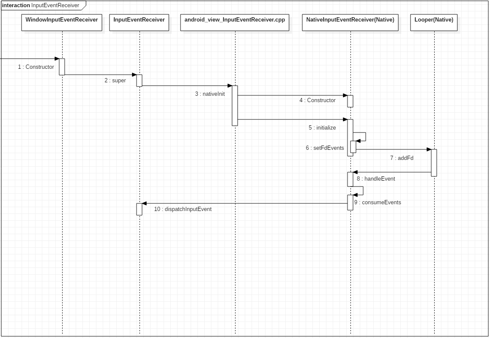

### 4.3.3. Java 层的事件流分发

```Java
public abstract class InputEventReceiver {
    
    // Called from native code.
    // 从Native层NativeInputEventReceiver::consumeEvents方法中回调
    private void dispatchInputEvent(int seq, InputEvent event, int displayId) {
        onInputEvent(event, displayId);
    }
    
}

public final class ViewRootImpl implements ViewParent,
        View.AttachInfo.Callbacks, ThreadedRenderer.DrawCallbacks {
        
    final class WindowInputEventReceiver extends InputEventReceiver {
        @Override
        public void onInputEvent(InputEvent event, int displayId) {
            enqueueInputEvent(event, this, 0, true);
        }
    }
    
}
```

InputEventReceiver.dispatchInputEvent 回调onInputEvent方法，真正实现是在ViewRootImpl 的enqueueInputEvent方法中

```Java
public final class ViewRootImpl implements ViewParent,
        View.AttachInfo.Callbacks, ThreadedRenderer.DrawCallbacks {
    
    // ViewRootImpl 中维护了一个 InputEvent 链表, 用来描述待处理的输入事件
    QueuedInputEvent mPendingInputEventHead;        
    QueuedInputEvent mPendingInputEventTail;
    
    void enqueueInputEvent(InputEvent event,
            InputEventReceiver receiver, int flags, boolean processImmediately) {
        // 1. 将 InputEvent 包装成一个 QueuedInputEvent, 添加到 ViewRootImpl 中维护的事件队列尾部
        QueuedInputEvent q = obtainQueuedInputEvent(event, receiver, flags);
        QueuedInputEvent last = mPendingInputEventTail;
        if (last == null) {
            mPendingInputEventHead = q;
            mPendingInputEventTail = q;
        } else {
            last.mNext = q;
            mPendingInputEventTail = q;
        }
        mPendingInputEventCount += 1;
        
        if (processImmediately) {
            // 2.1 是立即处理
            doProcessInputEvents();
        } else {
            // 2.2 添加到 MessageQueue 处理
            scheduleProcessInputEvents();
        }
    }
    
}
```

ViewRootImpl中维护了一个输入事件队列，enqueueInputEvent 先将它添加到队列尾部，
然后判断是否立即处理，立即处理或者添加到MessageQueue中最后都会调用doProcessInputEvents方法。

```Java
public final class ViewRootImpl implements ViewParent,
        View.AttachInfo.Callbacks, ThreadedRenderer.DrawCallbacks {
            
    void doProcessInputEvents() {
        while (mPendingInputEventHead != null) {
            QueuedInputEvent q = mPendingInputEventHead;
            ......
            // 分发这个待处理的事件
            deliverInputEvent(q);
        }
        ......
    }
    
    InputStage mFirstInputStage;
    InputStage mFirstPostImeInputStage;

    public void setView(View view, WindowManager.LayoutParams attrs, View panelParentView) {
        synchronized (this) {
            if (mView == null) {
                ......
                InputStage viewPostImeStage = new ViewPostImeInputStage(mSyntheticInputStage);
                InputStage nativePostImeStage = new NativePostImeInputStage(viewPostImeStage,
                        "aq:native-post-ime:" + counterSuffix);
                InputStage earlyPostImeStage = new EarlyPostImeInputStage(nativePostImeStage);
                InputStage imeStage = new ImeInputStage(earlyPostImeStage,
                        "aq:ime:" + counterSuffix);
                InputStage viewPreImeStage = new ViewPreImeInputStage(imeStage);
                InputStage nativePreImeStage = new NativePreImeInputStage(viewPreImeStage,
                        "aq:native-pre-ime:" + counterSuffix);
                mFirstInputStage = nativePreImeStage;
                mFirstPostImeInputStage = earlyPostImeStage;
            }
        }
    }

    private void deliverInputEvent(QueuedInputEvent q) {
        ......
        InputStage stage;
        if (q.shouldSendToSynthesizer()) {
            stage = mSyntheticInputStage;
        } else {
            stage = q.shouldSkipIme() ? mFirstPostImeInputStage : mFirstInputStage;
        }
        if (stage != null) {
            ......
            // 调用 stage.deliver 分发事件, 它的对象在 setView 中构建
            stage.deliver(q);
        } else {
            // 描述事件分发完毕
            finishInputEvent(q);
        }
    }
               
}
```

doProcessInputEvents 会调用deliverInputEvent 来分发这个事件
- 调用InputStage.deliver 来启动事件分发
- 调用finishInputEvent 来结束事件分发

#### 4.3.3.1. 事件分发的启动

ViewRootImpl 的InputState 对象是在setView时初始化的，看一下ViewPostImeInputStage实现

```Java
public final class ViewRootImpl implements ViewParent,
        View.AttachInfo.Callbacks, ThreadedRenderer.DrawCallbacks {
    
    abstract class InputStage {
        
        public final void deliver(QueuedInputEvent q) {
            if ((q.mFlags & QueuedInputEvent.FLAG_FINISHED) != 0) {
                forward(q);
            } else if (shouldDropInputEvent(q)) {
                finish(q, false);
            } else {
                // 1. 调用子类重写的 onProcess 方法
                apply(q, onProcess(q));
            }
        }
        
    }
    
    final class ViewPostImeInputStage extends InputStage {
        
        @Override
        protected int onProcess(QueuedInputEvent q) {
            if (q.mEvent instanceof KeyEvent) {
                ......
            } else {
                final int source = q.mEvent.getSource();
                if ((source & InputDevice.SOURCE_CLASS_POINTER) != 0) {
                    // 调用了 processPointerEvent 
                    return processPointerEvent(q);
                } 
                ......
            }
        }
        
        private int processPointerEvent(QueuedInputEvent q) {
            final MotionEvent event = (MotionEvent)q.mEvent;
            // 调用了 DecorView 的 dispatchPointerEvent
            boolean handled = mView.dispatchPointerEvent(event);
            ......
            return handled ? FINISH_HANDLED : FORWARD;
        }
        
    }
                
}
```
InputState.deliver 中回调了子类重写的onProcess, ViewPostImeInputStage 中调用processPointerEvent方法，最终会回调DecorView 的dispatchPointerEvent方法

##### 4.3.3.1.1. DecorView的事件分发

先看一下View类的事件分发

```Java
public class View implements Drawable.Callback, KeyEvent.Callback,
        AccessibilityEventSource {
            
    public final boolean dispatchPointerEvent(MotionEvent event) {
        // 若为触摸事件, 则调用 dispatchTouchEvent 进行分发
        if (event.isTouchEvent()) {
            return dispatchTouchEvent(event);
        } else {
            // 处理通用事件
            return dispatchGenericMotionEvent(event);
        }
    }
                
}
```

DecorView 重写了dispatchTouchEvent

```Java
public class DecorView extends FrameLayout implements RootViewSurfaceTaker, WindowCallbacks {
    
    public boolean dispatchTouchEvent(MotionEvent ev) {
        // 1. 获取 Window 的 Callback
        final Window.Callback cb = mWindow.getCallback();
        // 2. 若 Callback 有效, 则调用 Callback.dispatchTouchEvent 进行事件分发否则执行 View 的事件分发
        return cb != null && !mWindow.isDestroyed() && mFeatureId < 0
                ? cb.dispatchTouchEvent(ev) : super.dispatchTouchEvent(ev);
    }
    
}
```

这个Window.Callback是谁创建的？,看一下Activity的window创建过程

```Java
public class Activity extends ContextThemeWrapper {

    final void attach(Context context, ActivityThread aThread,
            Instrumentation instr, IBinder token, int ident,
            Application application, Intent intent, ActivityInfo info,
            CharSequence title, Activity parent, String id,
            NonConfigurationInstances lastNonConfigurationInstances,
            Configuration config, String referrer, IVoiceInteractor voiceInteractor,
            Window window, ActivityConfigCallback activityConfigCallback) {
        ......
        mWindow = new PhoneWindow(this, window, activityConfigCallback);
        ......
        // 把Activity与Window管理上
        mWindow.setCallback(this);
        ......
    }
}
```

##### 4.3.3.1.2. Activity事件分发

```Java
public class Activity extends ContextThemeWrapper {
    
    public boolean dispatchTouchEvent(MotionEvent ev) {
        if (ev.getAction() == MotionEvent.ACTION_DOWN) {
            onUserInteraction();
        }
        // 还是会优先调用 Window 的 superDispatchTouchEvent
        // 对应的实现是phoneWindow
        if (getWindow().superDispatchTouchEvent(ev)) {
            return true;
        }
        // 若是没有被消费, 则自行处理
        return onTouchEvent(ev);
    }
    
}
```
Activity中事件分发的处理：
- 先调用Window的superDispatchTouchEvent进行分发处理
- 若事件没有被消费，则调用onTouchEvent处理(下面的人都不处理，只能boss来了)

```Java
public class PhoneWindow extends Window implements MenuBuilder.Callback {
    
    @Override
    public boolean superDispatchTouchEvent(MotionEvent event) {
        // 调用了 DecorView 的 superDispatchTouchEvent 方法
        return mDecor.superDispatchTouchEvent(event);
    }
    
}

public class DecorView extends FrameLayout implements RootViewSurfaceTaker, WindowCallbacks {
    
     public boolean superDispatchTouchEvent(MotionEvent event) {
        return super.dispatchTouchEvent(event);
    }
    
}
```
可以发现，最终还是回调了View 的dispatchTouchEvent 方法，从此便进入了View的事件分发流程。

#### 4.3.3.2. 事件分发的结束

```Java
public final class ViewRootImpl implements ViewParent,
        View.AttachInfo.Callbacks, ThreadedRenderer.DrawCallbacks {
        
    private void finishInputEvent(QueuedInputEvent q) {
        ......
        if (q.mReceiver != null) {
            boolean handled = (q.mFlags & QueuedInputEvent.FLAG_FINISHED_HANDLED) != 0;
            // 调用了 InputEventReceiver 的 finishInputEvent 方法
            q.mReceiver.finishInputEvent(q.mEvent, handled);
        } else {
            ......
        }
    }
    
}

public abstract class InputEventReceiver {
    
    public final void finishInputEvent(InputEvent event, boolean handled) {
        ......
        if (mReceiverPtr == 0) {
            ......
        } else {
            ......
            if (index < 0) {
                ......
            } else {
                ......
                // 到了 Native 层结束事件分发
                nativeFinishInputEvent(mReceiverPtr, seq, handled);
            }
        }
        ......
    }
    
}
```
finishInputEvent 最终会调用InputEventReceiver的nativeFinishInputEvent ,主要是负责向IMS发送回执消息。

**客户端发送回执消息**

```C++
// frameworks/base/core/jni/android_view_InputEventReceiver.cpp
static void nativeFinishInputEvent(JNIEnv* env, jclass clazz, jlong receiverPtr,
        jint seq, jboolean handled) {
    // 调用了 NativeInputEventReceiver 的 finishInputEvent
    sp<NativeInputEventReceiver> receiver =
            reinterpret_cast<NativeInputEventReceiver*>(receiverPtr);
    status_t status = receiver->finishInputEvent(seq, handled);
    ......
}

status_t NativeInputEventReceiver::finishInputEvent(uint32_t seq, bool handled) {
    ......
    // 调用了 InputChannel 的 sendFinishedSignal 向服务端发送了一个执行结束的指令
    status_t status = mInputConsumer.sendFinishedSignal(seq, handled);
    ......
    return status;
}
```
最终调用了InputChannel的sendFinishedSignal通知服务端应用进程的事件分发结束了

还记得上面IMS注册InputChannel过程吗？它使用InputDispatcher内部的mLooper监听了服务端的socket端口，有数据会回调handleReceiveCallback，那么服务端收到了回执消息后的处理是怎样的？

**服务端处理回执消息**

```C++
// frameworks/native/services/inputflinger/InputDispatcher.cpp
int InputDispatcher::handleReceiveCallback(int fd, int events, void* data) {
    InputDispatcher* d = static_cast<InputDispatcher*>(data);

    { // acquire lock
        AutoMutex _l(d->mLock);
        // 1. 找到分发的窗体连接
        ssize_t connectionIndex = d->mConnectionsByFd.indexOfKey(fd);
        ......
        bool notify;
        sp<Connection> connection = d->mConnectionsByFd.valueAt(connectionIndex);
        if (!(events & (ALOOPER_EVENT_ERROR | ALOOPER_EVENT_HANGUP))) {
            ......
            nsecs_t currentTime = now();
            bool gotOne = false;
            status_t status;
            for (;;) {
                uint32_t seq;
                bool handled;
                // 2. 接收 Socket 发送过来的回执信息
                status = connection->inputPublisher.receiveFinishedSignal(&seq, &handled);
                if (status) {
                    break;
                }
                // 3. 处理回执数据
                d->finishDispatchCycleLocked(currentTime, connection, seq, handled);
                gotOne = true;
            }
            if (gotOne) {
                // 4. 执行 Commands
                d->runCommandsLockedInterruptible();
                if (status == WOULD_BLOCK) {
                    return 1;
                }
            }
            ......
        } else {
            ......
            // InputChannel 被关闭或者发生错误
        }
        ......
    } // release lock
}
```
IMS 处理回执消息流程：
- 找到分发事件的窗体连接Connection
- 通过Socket获取回执数据
- 调用finishDispatchCycledLocked添加分发结束指令
- 调用runCommandsLockedInterruptible对回执消息的处理

**添加结束指令**

```C++
// frameworks/native/services/inputflinger/InputDispatcher.cpp
void InputDispatcher::finishDispatchCycleLocked(nsecs_t currentTime,
        const sp<Connection>& connection, uint32_t seq, bool handled) {
    connection->inputPublisherBlocked = false;
    if (connection->status == Connection::STATUS_BROKEN
            || connection->status == Connection::STATUS_ZOMBIE) {
        return;
    }
    // 1. 通知其他组件分发下一个事件序列
    onDispatchCycleFinishedLocked(currentTime, connection, seq, handled);
}

void InputDispatcher::onDispatchCycleFinishedLocked(
        nsecs_t currentTime, const sp<Connection>& connection, uint32_t seq, bool handled) {
    // 2. 创建了一个指令信息实体类 CommandEntry
    CommandEntry* commandEntry = postCommandLocked(
            & InputDispatcher::doDispatchCycleFinishedLockedInterruptible);
    // 3. 填充数据
    commandEntry->connection = connection;
    commandEntry->eventTime = currentTime;
    commandEntry->seq = seq;
    commandEntry->handled = handled;
}

InputDispatcher::CommandEntry* InputDispatcher::postCommandLocked(Command command) {
    // 2.1 创建指令信息 CommandEntry 对象, 指令为 doDispatchCycleFinishedLockedInterruptible
    CommandEntry* commandEntry = new CommandEntry(command);
    // 2.2 添加到指令队列尾部
    mCommandQueue.enqueueAtTail(commandEntry);
    return commandEntry;
}
```

finishedDispatchCycleLocked处理回执数据的过程：
- 创建一个doDispatchCycleFinishedLockedInterruptible执行指令对象CommandEntry
- 将它添加到了指令队列的尾部，等待后续的执行

**执行结束指令**

```C++
// frameworks/native/services/inputflinger/InputDispatcher.cpp
bool InputDispatcher::runCommandsLockedInterruptible() {
    if (mCommandQueue.isEmpty()) {
        return false;
    }
    do {
        // 取出指令
        CommandEntry* commandEntry = mCommandQueue.dequeueAtHead();
        // 执行指令
        Command command = commandEntry->command;
        (this->*command)(commandEntry);
        // 删除指令
        commandEntry->connection.clear();
        delete commandEntry;
    } while (! mCommandQueue.isEmpty());
    return true;
}
```
InputDispatcher 执行指令的过程即遍历指令队列，执行具体的指令，我们看一下分发结束的执行函数：doDispatchCycleFinishedLockedInterruptible

```C++
// frameworks/native/services/inputflinger/InputDispatcher.cpp
void InputDispatcher::doDispatchCycleFinishedLockedInterruptible(
        CommandEntry* commandEntry) {
    sp<Connection> connection = commandEntry->connection;
    nsecs_t finishTime = commandEntry->eventTime;
    uint32_t seq = commandEntry->seq;
    bool handled = commandEntry->handled;
    // 1. 获取分发的事件
    DispatchEntry* dispatchEntry = connection->findWaitQueueEntry(seq);
    if (dispatchEntry) {
        ......
        if (dispatchEntry == connection->findWaitQueueEntry(seq)) {
            // 2. 将事件从等待分发完毕的队列中移除
            connection->waitQueue.dequeue(dispatchEntry);
            ......
        }
        // 3. 让当前 connection 去处理其 outboundQueue 中的后续事件
        startDispatchCycleLocked(now(), connection);
    }
}
```

至此，事件分发结束了，过程如下
- 获取本次分发的事件描述 dispatchEntry
- 从Connection待回执的事件队列waitQueue中移除
- 让Connection继续处理其待分发队列outboundQueue的后续时间

### 4.3.4. Connection整个流程

- 服务端Connection分发事件
  - 从outboundQueue取出一个事件，交给InputChannel的Socket端口发给客户端
  - 将这个事件添加到等待队列waitQueue
- 客户端处理完毕后通过InputChannel的Socket端口发给服务端
- 服务Connection的InputChannel接收到回执消息
  - 将这个事件从waitQueue中移除
  - 从outboundQueue获取下一个事件重复上述操作进行分发

## 4.4. IMS 总结

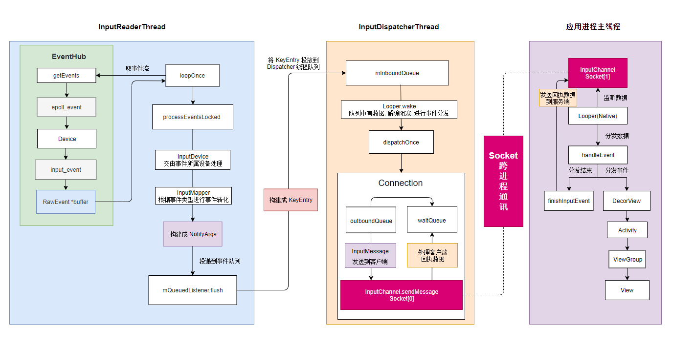

整个IMS事件分发大致的流程分析完毕，回顾一下整个事件分发流程
- 在Window创建过程时(WMS.addWindow)，创建了InputChannel输入通道组
  - 创建最大缓冲32kb的Socket
  - 服务端的InputChannel保留Socket服务端的文件描述符
  - 客户端的InputChannel保留Socket客户端的文件描述符
- 将服务端新建的 WindowState 和 InputChannel 注册到IMS 中
  - InputDispatcher 把WindowState 和InputChannel 封装到Connection 中用于后续事件的分发
- 客户端监听InputChannel
  - 应用进程拿到WMS传递过来的InputChannel后便会创建一个InputChannelReceived
  - InputChannelReceived在Native层监听了InputChannel的Socket端口
  - 有数据写入时便会通过JNI调用dispatchInputEvent分发到Java层
- 执行事件分发
  - 事件分发的启动
    - ViewRootImpl中维护了一个输入事件队列，这个事件最终会交给InputStage消费
    - InputStage中会将事件传递给DecorView
    - DecorView 首先会尝试将事件传给给当前的Window的 Callback 对象处理
      - 在Activity中创建Window时，执行了window.setCallback(activity),Callback就是Activity本身
    - Activity执行事件时会先将事件再次传给DecorView，最终调用View的dispatchTouchEvent 进入ViewGroup的事件分发流程
  - 事件分发的结束
    - 客户端发送回执消息
    - 服务端接收回执消息并处理
      - 创建结束指令到mCommandQueue指令队列
      - mCommandQueue执行的结束指令
        - 从Connection待回执的事件队列waitQueue中移除
        - 让Connection继续处理其待分发队列outboundQueue中的后续事件

# 5. View 事件分发

Android支持多指触控，一个完整的事件序列：
> DOWN ... MOVE ... POINTER_DOWN ... MOVE .... POINTER_UP ... MOVE .... UP 
从 DOWN -> POINTER_DOWN 称为焦点事件，在MotionEvent中用PointerId描述

## 5.1. ViewGroup 的事件分发

```Java
public abstract class ViewGroup extends View implements ViewParent, ViewManager {
    
    // TouchTarget 描述一个正在响应事件的 View
    // 一个 View 可以响应多个焦点事件
    // mFirstTouchTarget 为链表头
    private TouchTarget mFirstTouchTarget;
    
    @Override
    public boolean dispatchTouchEvent(MotionEvent ev) {
        ......
        boolean handled = false;
        // 过滤不安全的事件
        if (onFilterTouchEventForSecurity(ev)) {
            // 获取事件的类型
            final int action = ev.getAction();
            final int actionMasked = action & MotionEvent.ACTION_MASK;
            // 若为 ACTION_DOWN, 则说明是一个全新的事件序列
            if (actionMasked == MotionEvent.ACTION_DOWN) {
                cancelAndClearTouchTargets(ev);   // 清空所有 TouchTarget
                resetTouchState();                // 清空所有触摸状态
            }
            // 1. 处理事件拦截
            final boolean intercepted;
            // 1.1 若为初始事件 或 当前容器存在子 View 正在消费事件, 则尝试拦截
            if (actionMasked == MotionEvent.ACTION_DOWN || mFirstTouchTarget != null) {
                // 1.1.1 判断当前 ViewGroup 的 Flag 中是否设置了 不允许拦截事件
                // 通过 ViewGroup.requestDisallowInterceptTouchEvent 进行设置, 常用于内部拦截法, 由子 View 控制容器的行为
                final boolean disallowIntercept = (mGroupFlags & FLAG_DISALLOW_INTERCEPT) != 0;
                if (!disallowIntercept) {
                    // 若允许拦截, 则调用 onInterceptTouchEvent, 尝试进行拦截
                    intercepted = onInterceptTouchEvent(ev);
                    ev.setAction(action);
                } else {
                    // 不允许拦截, 则直接将标记为置为 false
                    intercepted = false;
                }
            } else {
                // 1.2 若非初始事件, 并且没有子 View 响应事件中的焦点, 则自己拦截下来由自己处理
                // 自己处理不代表一定能消费, 这点要区分开来
                intercepted = true;
            }
            ......
            // 判断当前容器是否被取消了响应事件
            final boolean canceled = resetCancelNextUpFlag(this)
                    || actionMasked == MotionEvent.ACTION_CANCEL;
            ......
            // 判断是否需要拆分 MotionEvent
            final boolean split = (mGroupFlags & FLAG_SPLIT_MOTION_EVENTS) != 0;
            TouchTarget newTouchTarget = null;                // 描述响应的目标
            boolean alreadyDispatchedToNewTouchTarget = false;// 描述这个事件是否分发给了新的 TouchTarget
            if (!canceled && !intercepted) {
                ......
                // 2. 若为 ACTION_DOWN 或者 ACTION_POINTER_DOWN, 则说明当前事件序列出现了一个新的焦点, 则找寻该焦点的处理者
                if (actionMasked == MotionEvent.ACTION_DOWN
                        || (split && actionMasked == MotionEvent.ACTION_POINTER_DOWN)
                        || actionMasked == MotionEvent.ACTION_HOVER_MOVE) { 
                    // 2.1 获取焦点的索引(第一个手指的 down 为 0, 第二个手指的 down 为 1)
                    final int actionIndex = ev.getActionIndex(); // always 0 for down
                    // 将焦点的索引序号映射成二进制位, 用于后续保存在 TouchTarget 的 pointerIdBits 中
                    // 0 -> 1, 1 -> 10, 2 -> 100
                    final int idBitsToAssign = split ? 1 << ev.getPointerId(actionIndex) : TouchTarget.ALL_POINTER_IDS;
                    // 清理 TouchTarget 中对历史遗留的 idBitsToAssign 的缓存
                    removePointersFromTouchTargets(idBitsToAssign);
                    final int childrenCount = mChildrenCount;
                    if (newTouchTarget == null && childrenCount != 0) {
                        // 2.2 获取事件在当前容器中的相对位置
                        final float x = ev.getX(actionIndex);
                        final float y = ev.getY(actionIndex);
                        // 获取当前容器前序遍历的 View 序列(即层级从高到低排序)
                        final ArrayList<View> preorderedList = buildTouchDispatchChildList();
                        // 2.3 遍历子 View, 找寻可以响应事件的目标
                        final boolean customOrder = preorderedList == null
                                && isChildrenDrawingOrderEnabled();
                        final View[] children = mChildren;
                        for (int i = childrenCount - 1; i >= 0; i--) {
                            // 通过索引找到子孩子实例
                            final int childIndex = getAndVerifyPreorderedIndex(
                                    childrenCount, i, customOrder);
                            final View child = getAndVerifyPreorderedView(
                                    preorderedList, children, childIndex);
                            ......
                            // 2.3.1 判断这个子 View 是否在响应事件的区域
                            if (!canViewReceivePointerEvents(child)
                                    || !isTransformedTouchPointInView(x, y, child, null)) {
                                ......
                                // 若不在可响应的区域, 则继续遍历下一个子 View
                                continue;
                            }
                            // 2.3.2 判断获取这个子 View, 是否已经响应了序列中的一个焦点
                            newTouchTarget = getTouchTarget(child);
                            if (newTouchTarget != null) {
                                // 若这个 View 已经响应了一个焦点, 则在它的 TouchTarget.pointerIdBits 添加新焦点的索引
                                newTouchTarget.pointerIdBits |= idBitsToAssign;
                                // 则直接结束查找, 直接进行后续的分发操作
                                break;
                            }
                            ......
                            // 2.3.3 调用 dispatchTransformedTouchEvent 尝试将这个焦点分发给这个 View 处理
                            if (dispatchTransformedTouchEvent(ev, false, child, idBitsToAssign)) {
                                ......
                                // 子 View 成功的消费了这个事件, 则将这个 View 封装成 TouchTarget 链到表头
                                newTouchTarget = addTouchTarget(child, idBitsToAssign);
                                // 表示这个事件在找寻新的响应目标时已经消费了
                                alreadyDispatchedToNewTouchTarget = true;
                                break;
                            }
                            ......
                        }
                        ......
                    }
                    // 2.4 若没有找到可以响应的子 View, 则交由最早的 TouchTarget 处理
                    if (newTouchTarget == null && mFirstTouchTarget != null) {
                        newTouchTarget = mFirstTouchTarget;
                        while (newTouchTarget.next != null) {
                            newTouchTarget = newTouchTarget.next;
                        }
                        // 在其 pointerIdBits 保存焦点的 ID 
                        newTouchTarget.pointerIdBits |= idBitsToAssign;
                    }
                }
            }
            // 3. 执行事件分发
            // 3.1 没有任何子 View 可以响应事件序列, 则交由自己处理
            if (mFirstTouchTarget == null) {
                handled = dispatchTransformedTouchEvent(ev, canceled, null,
                        TouchTarget.ALL_POINTER_IDS);
            } else {
                // 3.2 若存在子 View 响应事件序列, 则将这个事件分发下去
                TouchTarget predecessor = null;
                TouchTarget target = mFirstTouchTarget;
                while (target != null) {
                    final TouchTarget next = target.next;
                    // 3.2.1 alreadyDispatchedToNewTouchTarget 为 true 并且 target 为我们上面新找到的响应目标时, 跳过这次分发
                    // 因为在查找焦点处理者的过程中, 已经分发给这个 View 了
                    if (alreadyDispatchedToNewTouchTarget && target == newTouchTarget) {
                        handled = true;
                    } else {
                        // 3.2.2 处理还未消耗这个事件的子 View
                        final boolean cancelChild = resetCancelNextUpFlag(target.child)
                                || intercepted;// 判断是否需要给 View 发送 CANCEL 事件, view 设置了 PFLAG_CANCEL_NEXT_UP_EVENT 这个 Flag, 或者这个事件被该容器拦截了, 那么将会给子 View 发送 Cancel 事件
                        // 3.2.2 调用 dispatchTransformedTouchEvent 将事件分发给子 View 
                        if (dispatchTransformedTouchEvent(ev, cancelChild,
                                target.child, target.pointerIdBits)) {
                            handled = true;
                        }
                        // 3.2.3 若给这个 View 分发了 cancel 事件, 则说明它已经无法响应事件序列的焦点了, 因此将它从响应链表中移除
                        if (cancelChild) {
                            if (predecessor == null) {
                                mFirstTouchTarget = next;
                            } else {
                                predecessor.next = next;
                            }
                            target.recycle();
                            target = next;
                            continue;
                        }
                    }
                    predecessor = target;
                    target = next;
                }
            } 
            // 4. 清理失效的 TouchTarget
            // 4.1 若事件序列取消 或 整个事件 UP 了, 则移除所有的 TouchTarget
            if (canceled || actionMasked == MotionEvent.ACTION_UP || actionMasked == MotionEvent.ACTION_HOVER_MOVE) {
                resetTouchState();
            } else if (split && actionMasked == MotionEvent.ACTION_POINTER_UP) {
                // 4.2 若事件序列的一个焦点 UP 了, 则移除响应这个焦点的 TouchTarget
                final int actionIndex = ev.getActionIndex();
                final int idBitsToRemove = 1 << ev.getPointerId(actionIndex);
                removePointersFromTouchTargets(idBitsToRemove);
            }
        }
        ......
        return handled;
    }
    
}
```
总结一下：
- 拦截事件
  - 若为 起始事件 ACTION_DOWN/ACTION_POINTER_DOWN 或 存在子View正在消费事件，则调用onInterceptTouchEvent尝试拦截
    - 若设置了FLAG_DISALLOW_INTERCEPT 则不进行拦截操作，直接分发给子View
  - 若非 起始事件 并且没有子View响应事件，则进行拦截操作
- 寻找起始事件的处理者
  - 通过 canViewReceivePointerEvents 和 isTransformedTouchPointInView 找寻区域内的子View
    - 若子View已经响应了一个焦点事件序列，则将这个事件序列的id添加到这个View对应的TouchTarget的pointerIdBits中
    - 若子View当前未响应事件，则调用dispatchTransformedTouchEvent尝试让子View处理
      - 处理成功，则将这个View构建成TouchTarget保存起来
  - 若无处理者，则交由mFirstTouchTarget处理
- 执行事件分发
  - 若无响应目标，则ViewGroup自行处理
  - 若存在响应目标，则遍历TouchTarget链表，将事件分发给所有的TouchTarget

当产生一个新的事件焦点时，如何找到响应它的子View呢？
### 5.1.1. 寻找事件的响应目标

在ViewGoup的dispatchTouchEvent中，我们知道判断一个View是否可以响应事件主要有两个方法：canViewReceivePointerEvents 和 isTransformedTouchPointInView 

canViewReceivePointerEvents : 根据View 的状态判断是否可以接受事件

```Java
public abstract class ViewGroup extends View implements ViewParent, ViewManager {
    
    private static boolean canViewReceivePointerEvents(@NonNull View child) {
        // Condition1: View 为 Visible
        // Condition2: 当前 View 设置了动画
        return (child.mViewFlags & VISIBILITY_MASK) == VISIBLE
                || child.getAnimation() != null;
    }
    
}
```

isTransformedTouchPointInView : 判断事件的相对坐标是否落在子View的宽高之内

```Java
public abstract class ViewGroup extends View implements ViewParent, ViewManager {
    
    protected boolean isTransformedTouchPointInView(float x, float y, View child,
            PointF outLocalPoint) {
        // 1. 获取一个坐标数组, 数据为事件在当前 ViewGroup 中的相对坐标 x, y 值
        final float[] point = getTempPoint();
        point[0] = x;
        point[1] = y;
        // 2. 调用了 transformPointToViewLocal, 将坐标转为 Child 的相对坐标
        transformPointToViewLocal(point, child);
        // 3. 调用了 View.pointInView 判断坐标是否落在了 View 中
        final boolean isInView = child.pointInView(point[0], point[1]);
        // 若在子 View 中, 则尝试输出到 outLocalPoint 中, dispatchTouchEvent 中传入的为 null
        if (isInView && outLocalPoint != null) {
            outLocalPoint.set(point[0], point[1]);
        }
        return isInView;
    }
    
     public void transformPointToViewLocal(float[] point, View child) {
        // 2.1 将 point 转为 View 的相对坐标
        point[0] += mScrollX - child.mLeft;
        point[1] += mScrollY - child.mTop;
        // 2.2 若 View 设置了 Matrix 变化, 则通过 Matrix 来映射这个坐标
        if (!child.hasIdentityMatrix()) {
            child.getInverseMatrix().mapPoints(point);
        }
    }
    
}

public class View implements Drawable.Callback, KeyEvent.Callback,
        AccessibilityEventSource {
    
    final boolean pointInView(float localX, float localY) {
        return pointInView(localX, localY, 0);
    }
    
    public boolean pointInView(float localX, float localY, float slop) {
        // 很简单, 即判断是否落在 View 的区域内, 小于 View 的宽度和高度
        // slop 为当前 Android 系统能够识别出来的手指区域的大小
        return localX >= -slop && localY >= -slop && localX < ((mRight - mLeft) + slop) &&
                localY < ((mBottom - mTop) + slop);
    }
    
}
```
在transformPointToViewLocal方法中，会调用 child.getInverseMatrix().mapPoints(point) 来映射一次坐标，为什么呢？
- 因为我们在执行属性动画的时候，有的时候会进行View的transition ，scale 等操作，这些操作并不会改变View的原始坐标，但会改变它内部的RenderNode的Matrix，进行坐标映射，是为了让View 在变化后的区域依旧可以响应事件流，这就是为什么属性动画后View依旧可以响应点击事件的原因。

在子View判断完是否可以响应事件后，看一下ViewGroup事件流是如何分发的？

## 5.2. 将事件分发给子View

在ViewGroup.dispatchTouchEvent中，我们知道最后它会遍历TouchTarget链表，逐个调用dispatchTransformedTouchEvent方法，将一个事件分发给该事件所在序列的所有焦点处理者，是怎么做到的？

```Java
public abstract class ViewGroup extends View implements ViewParent, ViewManager {
    
    private boolean dispatchTransformedTouchEvent(MotionEvent event, boolean cancel,
            View child, int desiredPointerIdBits) {
        final boolean handled;
        // 获取事件的动作
        final int oldAction = event.getAction();
        // 1. 处理 Cancel 操作
        if (cancel || oldAction == MotionEvent.ACTION_CANCEL) {
            // 1.1 将事件的 Action 强行改为 ACTION_CANCEL
            event.setAction(MotionEvent.ACTION_CANCEL);
            // 1.2 ACTION_CANCEL 的分发操作
            if (child == null) {
                // 1.2.1 自己处理
                handled = super.dispatchTouchEvent(event);
            } else {
                // 1.2.2 分发给子 View 
                handled = child.dispatchTouchEvent(event);
            }
            event.setAction(oldAction);
            return handled;
        }
        
        // 2. 判断这个 child 是否可以响应该事件
        // 2.1 获取这个事件所在序列的所有焦点
        final int oldPointerIdBits = event.getPointerIdBits();
        // 2.2 desiredPointerIdBits 描述这个 child 能够处理的焦点
        final int newPointerIdBits = oldPointerIdBits & desiredPointerIdBits; 
        // 2.3 若他们之间没有交集, 则说明出现了异常情况, 这个 child 所响应的并非是这个事件序列中的焦点
        if (newPointerIdBits == 0) {
            return false;
        }
        
        // 3. 将事件分发给子 View 
        final MotionEvent transformedEvent;
        // 3.1 若这个子 View 能够处理这个事件序列的所有焦点, 则直接进行分发操作
        if (newPointerIdBits == oldPointerIdBits) {
            // 若不存子 View, 或者子 View 设置 Matrix 变幻, 则走下面的分支
            if (child == null || child.hasIdentityMatrix()) {
                if (child == null) {
                    // 3.1.1 自己处理
                    handled = super.dispatchTouchEvent(event);
                } else {
                    // 3.1.2 分发给子 View
                    ......
                    handled = child.dispatchTouchEvent(event);
                    ......
                }
                return handled;
            }
            transformedEvent = MotionEvent.obtain(event);
        } else {
            // 3.2 若这个子 View 只能够处理事件序列中部分的焦点, 则调用 MotionEvent.split 进行焦点分割
            transformedEvent = event.split(newPointerIdBits);
        }

        if (child == null) {
            // 3.2.1 不存在子 View 则自己处理
            handled = super.dispatchTouchEvent(transformedEvent);
        } else {
            // 3.2.2 将进行焦点分割后的事件, 分发给子 View
            ......
            handled = child.dispatchTouchEvent(transformedEvent);
        }
        ......
        return handled;
    }
    
}
```

来看一下TouchTarget的实现

```Java

// 遍历mFirstTouchTarget链表，检测每个节点的child是不是方法参数中的child
// 参数中的child是要分派触摸事件的子View
private TouchTarget getTouchTarget(View child) {
    for (TouchTarget target = mFirstTouchTarget; target != null; target = target.next) {
        if (target.child == child) {
            return target;
        }
    }
    return null;
}

private static final class TouchTarget {

    public View child;

    // 可以理解为当前已按下的手指数
    public int pointerIdBits;

    public TouchTarget next;

    ......
}
```

在dispatchTransformedTouchEvent返回了true以后，会调用addTouchTarget方法
```Java
private TouchTarget addTouchTarget(View child, int pointerIdBits) {
    final TouchTarget target = TouchTarget.obtain(child, pointerIdBits);
    target.next = mFirstTouchTarget;
    mFirstTouchTarget = target;
    return target;
}
```
第一次分派事件给子View之后，会把子View和pointerIdBits记录到mFirstTouchTarget中。
当新手指按下时，会先从链表mFirstTouchTarget中查找有没有（该子View）的节点
- 有的话更新这个节点的pointerIdBits，也就是刷新当前手指按下的数量
- 没有的话，说明这个子View还没有手指按下过

在dispatchTransformedTouchEvent中检测到是多指按下时，会把事件拆分，最后分派拆分（调用split方法把ACTION_POINTER_DOWN改为ACTION_DOWN）后的事件给子View。分派事件后，又把这个子View和手指数量记录到链表中。

可以看到，只要View能够处理当前MotionEvent所在事件序列中的一个焦点，便会分发给它，分发之前会调用MotionEvent.split将事件分割成为View能够处理的焦点事件，并将其分发下去。


#### 5.2.0.1. MotionEvent事件

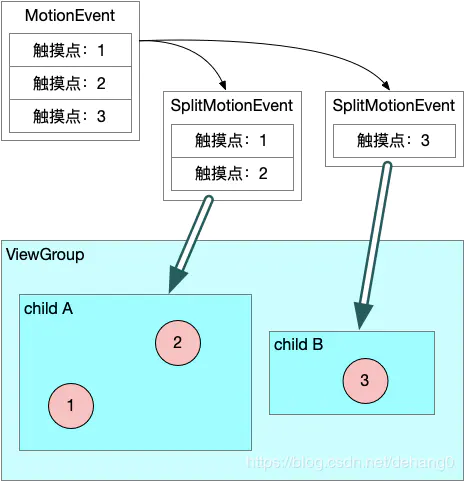

当两个及以上的手指触摸屏幕时，会产生多个触摸事件传递给ViewGroup，改MotionEvent中除了
存储事件类型和坐标位置等信息外，还会保存一组触摸点信息。当触摸点落在ViewGroup的不同child上时，需要对MotionEvent进行事件拆分，再将拆分后的事件派发给对应的child。

MotionEvent的action为int型，高8位存储触摸点索引集合，低8位才是存储动作类型。
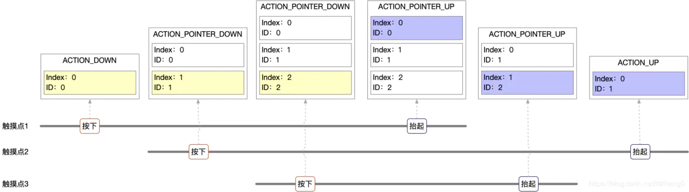

可以看出，索引值是会相对变化的，而ID值保持不变。

MotionEvent.split 方法主要根据出入的idBits调整事件的Action
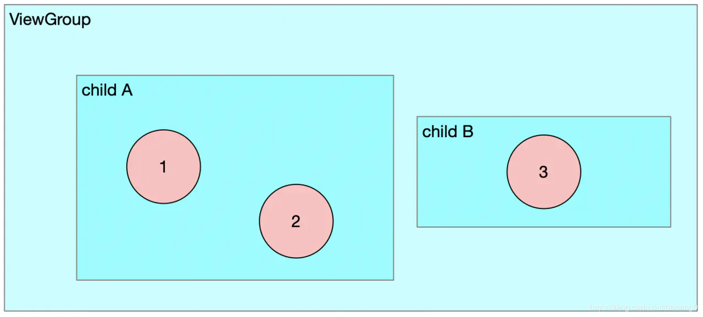
- 触摸点3按下时，ViewGroup会收到 ACTION_POINTER_DOWN 事件，该触摸点是ChildB感兴趣的，对于ChildB来说是一个全新的事件序列，因为派发给childB时，需要将类型调整ACTION_DOWN。而对于childA 来说，并不是它感兴趣的，因此在派发给childA时，调整为ACTION_MOVE 。
- 当触摸点2抬起时，ViewGroup会收到 ACTION_POINTER_UP 事件，改事件是childA感兴趣的，但是childA上仍有触摸点1，因此派发给childA 的事件类型依旧是ACTION_DOWN_UP。而派发给childB时，调整为ACTION_MOVE。

**事件拆分是为了在多点触摸情况下更准确的将事件传递给子View，在派发过程中，ViewGroup不会原样把MotionEvent派发给子View，而是根据落于子View上的触摸点，调整MotionEvent中的事件类型和触摸点信息后生成新的MotionEvent副本，再用这个MotionEvent副本派发给对应的子View。**

```
E/TAG: --------------------dispatch begin----------------------
E/TAG: ViewGroup PointerId is: 0, eventRawX 531.7157, eventRawY 747.5201
E/TAG: Child PointerId is: 1, eventRawX 467.7539, eventRawY 1387.9688
E/TAG: Child PointerId is: 0, eventRawX 531.7157, eventRawY 747.5201
E/TAG: --------------------dispatch begin----------------------
E/TAG: ViewGroup PointerId is: 0, eventRawX 534.09283, eventRawY 744.18854
E/TAG: Child PointerId is: 1, eventRawX 467.7539, eventRawY 1387.9688
E/TAG: Child PointerId is: 0, eventRawX 534.09283, eventRawY 744.18854
```
从日志可以看出，ViewGroup中的一个事件的确会分发给这个事件序列所有的焦点处理者，可以看到MotionEvent.split方法，不仅仅分割了焦点，并且还巧妙的将触摸事件转换到了焦点处理View对应的区域，Google这里处理的原因可能是为了保证触摸过程中事件的连续性，以实现更好的交互效果。

## 5.3. View的事件分发

```Java
public class View implements Drawable.Callback, KeyEvent.Callback,
        AccessibilityEventSource {
    
    public boolean dispatchTouchEvent(MotionEvent event) {
        ......
        boolean result = false;
        ......
        // 获取 Mask 后的 action
        final int actionMasked = event.getActionMasked();
        // 若为 DOWN, 则停止 Scroll 操作
        if (actionMasked == MotionEvent.ACTION_DOWN) {
            // Defensive cleanup for new gesture
            stopNestedScroll();
        }
        // 处理事件
        if (onFilterTouchEventForSecurity(event)) {
            // 1. 若是拖拽滚动条, 则优先将事件交给 handleScrollBarDragging 方法消耗
            if ((mViewFlags & ENABLED_MASK) == ENABLED && handleScrollBarDragging(event)) {
                result = true;
            }
            // 2. 若 ListenerInfo 中设置了 OnTouchListener, 则尝试将其交给 mOnTouchListener 消耗
            ListenerInfo li = mListenerInfo;
            if (li != null && li.mOnTouchListener != null
                    && (mViewFlags & ENABLED_MASK) == ENABLED
                    && li.mOnTouchListener.onTouch(this, event)) {
                result = true;
            }
            // 3. 若上面的操作没有将 result 位置 true, 则交给 onTouchEvent 消耗
            if (!result && onTouchEvent(event)) {
                result = true;
            }
        }
        ......
        return result;
    }
               
}
```
View的dispatchTouchEvent主要操作：
- 优先将事件交给 ScrollBar 处理
  - 成功消费则将 result = true
- 次优先将事件交给OnTouchListener处理
  - 成功消费则将 result = true
- 最后将事件交给onTouchEvent处理

### 5.3.1. View 的 OnTouchEvent 处理事件

```Java
public class View implements Drawable.Callback, KeyEvent.Callback,
        AccessibilityEventSource {
            
    public boolean onTouchEvent(MotionEvent event) {
        final float x = event.getX();
        final float y = event.getY();
        final int viewFlags = mViewFlags;
        final int action = event.getAction();
        // 判断当前 View 是否是可点击的
        final boolean clickable = ((viewFlags & CLICKABLE) == CLICKABLE
                || (viewFlags & LONG_CLICKABLE) == LONG_CLICKABLE)
                || (viewFlags & CONTEXT_CLICKABLE) == CONTEXT_CLICKABLE;

        ......
        // 若设置了代理, 则交由代理处理
        if (mTouchDelegate != null) {
            if (mTouchDelegate.onTouchEvent(event)) {
                return true;
            }
        }
        // 执行事件处理
        if (clickable || (viewFlags & TOOLTIP) == TOOLTIP) {
            switch (action) {
                // 1. 处理按压事件
                case MotionEvent.ACTION_DOWN:
                    ......
                    // 处理 View 在可滑动容器中的按压事件
                    if (isInScrollingContainer) {
                        ......
                    } else {
                        // 处理在非滑动容器中的按压事件
                        // 1.1 设置为 Pressed 状态
                        setPressed(true, x, y);
                        // 1.2 尝试添加一个长按事件
                        checkForLongClick(0, x, y);
                    }
                    break;
                // 2. 处理移动事件
                case MotionEvent.ACTION_MOVE:
                    ......
                    // 处理若移动到了 View 之外的情况
                    if (!pointInView(x, y, mTouchSlop)) {
                        // 移除 TapCallback
                        removeTapCallback();
                        // 移除长按的 Callback
                        removeLongPressCallback();
                        // 清除按压状态
                        if ((mPrivateFlags & PFLAG_PRESSED) != 0) {
                            setPressed(false);
                        }
                        ......
                    }
                    break;
                // 3. 处理 UP 事件
                case MotionEvent.ACTION_UP:
                    // 3.1 若置为不可点击了, 则移除相关回调, 重置相关 Flag
                    if (!clickable) {
                        removeTapCallback();
                        removeLongPressCallback();
                        ......
                        break;
                    }
                    // 3.2 判断 UP 时, View 是否处于按压状态
                    boolean prepressed = (mPrivateFlags & PFLAG_PREPRESSED) != 0;
                    if ((mPrivateFlags & PFLAG_PRESSED) != 0 || prepressed) {
                        ......
                        // 3.2.1 若没有触发长按事件, 则处理点击事件
                        if (!mHasPerformedLongPress && !mIgnoreNextUpEvent) {
                            removeLongPressCallback();// 移除长按回调
                            // 处理点击事件
                            if (!focusTaken) {
                                // 创建一个事件处理器
                                if (mPerformClick == null) {
                                    mPerformClick = new PerformClick();
                                }
                                // 发送到 MessageQueue 中执行
                                if (!post(mPerformClick)) {
                                    performClickInternal();
                                }
                            }
                        }
                        // 清除按压状态
                        ......
                    }
                    ......
                    break;
                // 4. 处理取消事件
                case MotionEvent.ACTION_CANCEL:
                    // 移除回调, 重置标记位
                    if (clickable) {
                        setPressed(false);
                    }
                    removeTapCallback();
                    removeLongPressCallback();
                    mInContextButtonPress = false;
                    mHasPerformedLongPress = false;
                    mIgnoreNextUpEvent = false;
                    break;
            }
            return true;
        }
        return false;
    }
                
}
```
onTouchEvent 事件处理：
- ACTION_DOWN
  - 将View设置为按压状态
  - 添加了一个长按监听器
- ACTION_MOVE
  - 若坐标在View的范围之外，则移除相关回调，清除按压状态
- ACTION_UP 
  - 若长按事件没有相应，则处理View的点击事件
  - 移除按压状态
- ACTION_CANCEL 
  - 移除相关回调，清除按压状态

## 5.4. View事件处理总结

### 5.4.1. ViewGroup 事件分发总结

- 拦截事件
  - 若为 起始事件 ACTION_DOWN/ACTION_POINTER_DOWN 或 存在子View正在消费事件，则调用onInterceptTouchEvent尝试拦截
    - 若设置了FLAG_DISALLOW_INTERCEPT 则不进行拦截操作，直接分发给子View
  - 若非 起始事件 并且没有子View响应事件，则进行拦截操作
- 寻找起始事件的处理者
  - 通过 canViewReceivePointerEvents 和 isTransformedTouchPointInView 找寻区域内的子View
    - 若子View已经响应了一个焦点事件序列，则将这个事件序列的id添加到这个View对应的TouchTarget的pointerIdBits中
    - 若子View当前未响应事件，则调用dispatchTransformedTouchEvent尝试让子View处理
      - 处理成功，则将这个View构建成TouchTarget保存起来
  - 若无处理者，则交由mFirstTouchTarget处理
- 执行事件分发
  - 若无响应目标，则ViewGroup自行处理
  - 若存在响应目标，则遍历TouchTarget链表，将事件分发给所有的TouchTarget

### 5.4.2. View 事件分发总结

- 优先将事件交给 ScrollBar 处理
  - 成功消费则将 result = true
- 次优先将事件交给OnTouchListener处理
  - 成功消费则将 result = true
- 最后将事件交给onTouchEvent处

>属性动画不会改变View真正位置，它改变的是View硬件渲染结点 mRenderNode的矩阵数据
- RenderNode是View硬件渲染机制中用来捕获View渲染动作的
- ViewGroup的dispatchTouchTarget在寻找事件位置所在区域的子View时，会计算View矩阵映射后的坐标，因此事件分发天然就支持属性动画变换的
>为什么ViewGroup会将一个事件分发给所有的TouchTarget，只分发给响应位置的TouchTarget不行？
- 当一个手指按在屏幕上进行滑动时，另一个手指也按上去，此时他们都是连续的触摸事件
- 但事件分发一次只能分发一个事件，为了保证所有View响应的连续性，分发时会调用MotionEvent.split方法，巧妙的将触摸事件转换到了焦点处理View对应的区域，以实现更好的交互效果。


## 5.5. WMS处理部分

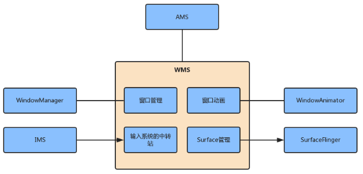

 

# 6. Android 中常见的IPC机制都有哪些？

IPC：进程间通信

## Linux中的IPC机制

**管道 Pipe**
管道：在内存中创建一个共享文件，从而使通信双方利用这个共享文件传递消息，这个共享文件只存在于内存中，管道采用半双工通信方式。半双工指的是不能在两个方向上
同时进行数据传输，必须轮流交替进行。类似步话机。

**信号**
信号是一种异步通信方式，可以在用户空间和内核之间直接交互，内核可以利用信号来通知用户空间的进程发生了哪些系统事件，信号不适用与信息交互，适用于进程中断控制。

**信号量**
信号量是一个计数器，用来控制多个进程对共享资源的访问，信号量常作为一种锁机制，作为进程间或者同一进程内多线程之间的同步手段。

**消息队列**
消息队列是消息的链表，存在在内存中由消息队列标志符对其进行标识，允许一个或多个进程对它进行读写。使用消息队列会使消息复制两次，对于频繁通信或消息量大的通信不建议使用。

**共享内存**
共享内存是多个进程可以直接读写一块内存空间，内核专门留出一块内存去，由需要访问的进程将其映射到自己的私有地址空间。

**套接字**
套接字是更基础的进程间通信机制，可用于不同机器间的进程通信。

## Android 中的IPC机制

**Bundle**
只能传输Bundle支持的数据，四大组件间的进程间通信

**文件共享**
不适合高并发场景，无法做到即时通信

**AIDL**
支持一对多，支持实时通信，需要处理好线程同步，满足跨进程的方法调用

**Messenger**
支持一对多串行通信，不支持RPC，数据通过Message进行传输

**ContentProvider**
底层实现也是Binder，在不同应用程序间传递数据，支持一对多并发数据共享，可通过Call进行扩展

**Socket**
支持一对多并发实时通信，可通过网络传输字节流


# 7. Android Binder机制？

## 什么是Binder？
>Binder是一种进程间通信的方式，还可以理解为一种虚拟的物理设备，设备驱动是/dev/binder，从framework层讲，Binder是ServiceManager连接各种XXXManager和XXXManagerService之间的桥梁，从应用角度来讲，Binder是客户端和服务端进行通信的媒介，bindService时，服务端会返回一个包含了服务端提供的服务或数据，这里的服务包括普通服务和基于AIDL的服务。

从系统角度讲，Binder机制分为Java Binder/Native Binder/Kernel Binder。
用户空间和内核空间是隔离的，用户空间想要访问内核空间就必须通过系统调用，copy_from_user 和 copy_to_user 。

内存映射？
应用程序不能直接操作设备硬件地址，所以系统提供了一种机制：内存映射，把设备地址映射到进程虚拟内存区。

- 如果不采用内存映射，当用户空间想要读取磁盘文件时，就需要在内核空间建立一个页缓存，页缓存去复制磁盘的文件，然后用户空间复制页缓存的文件，这就进行了两次复制。
- 如果采用内存映射，用户空间调用系统函数mmap来将用户空间的一块内存映射到内核空间。内核空间会创建一个虚拟内存区域，用来与磁盘文件直接映射，映射关系建好后，用户对这块内存区域的修改就直接反映到内核空间了。

Binder基于内存映射来实现的。Binder通信的步骤如下：
- Binder驱动在内核空间创建一个 **数据接收缓存区**
- 在内核空间开辟一块 **内核缓存区** ，建立内核缓存区和数据接收缓存区之间的映射关系，以及数据接收缓存区和接收进程用户空间地址的映射关系。
- 发送方进程通过 copy_to_user 将数据复制到内核中的内核缓存区，由于内核缓存区和接收进程的用户空间存在内存映射，因此就是相当于把数据发给了接收进程的用户空间，完成一次及进程间通信。

为什么选择Binder？
- 性能好，管道、消息队列、Socket都需要复制两次，Binder只复制一次，仅次于共享内存（不需要复制）
- 稳定性好，基于C/S架构。共享内存没有分层，并发同步访问临界资源时，还可能发生死锁。
- 安全性高，传统IPC无法获得对方可靠的进程用户ID/进程ID，无法鉴别身份。

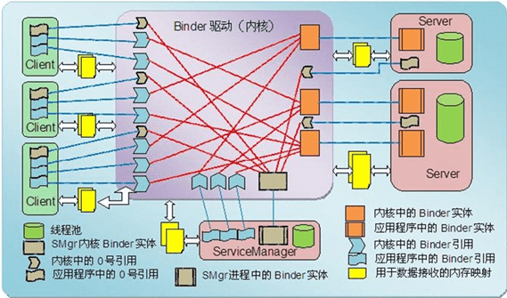

### 关于Binder，有几个重要操作：

#### 驱动初始化
Binder驱动程序的初始化是在init进程中进行的，通过binder_init实现。
```C++
// kernel/goldfish/drivers/staging/android/binder.c
static int __init binder_init(void)
{
	......
	// 创建设备名称
	device_names = kzalloc(strlen(binder_devices_param) + 1, GFP_KERNEL);
	strcpy(device_names, binder_devices_param);
	while ((device_name = strsep(&device_names, ","))) {
	    // 1. 调用了 init_binder_device 初始化设备
		ret = init_binder_device(device_name);
		......
	}
	// 声明了 Binder 驱动可使用的目录: /proc/binder
	binder_debugfs_dir_entry_root = debugfs_create_dir("binder", NULL);
	// 2. 为当前进程创建了: /proc/binder/proc 目录
	// 每个使用了 Binder 进程通信机制的进程在该目录下都对应一个文件
	if (binder_debugfs_dir_entry_root) {
	    binder_debugfs_dir_entry_proc = debugfs_create_dir("proc",binder_debugfs_dir_entry_root);
	}
	// 3. 在 /proc/binder 目录下创建 state, stats, transactions, transaction_log, failed_transaction_log 这几个文件
	// 用于读取 Binder 驱动运行状况
	if (binder_debugfs_dir_entry_root) {
		debugfs_create_file("state",
				    S_IRUGO,
				    binder_debugfs_dir_entry_root,
				    NULL,
				    &binder_state_fops);
		...
	}
	return ret;
}

static int __init init_binder_device(const char *name)
{
	int ret;
	struct binder_device *binder_device;
	struct binder_context *context;

	binder_device = kzalloc(sizeof(*binder_device), GFP_KERNEL);
	if (!binder_device)
		return -ENOMEM;

	binder_device->miscdev.fops = &binder_fops;
	binder_device->miscdev.minor = MISC_DYNAMIC_MINOR;
	binder_device->miscdev.name = name;
    ......
    // 调用了 misc_register 来注册一个 Binder 设备
	ret = misc_register(&binder_device->miscdev);
    ......
	return ret;
}
```
初始化主要完成：
- init_binder_device 初始化Binder设备
  - 调用misc_register 注册一个Binder设备
- 创建目录 /proc/binder/
  - 每一个使用了 Binder 进程间通信机制的进程, 在该目录下都对应一个文件, 文件以进程 ID 命名。通过他们就可以读取到各个进程的 Binder 线程池, Binder 实体对象, Binder 引用对象以及内核缓冲区等消息
  - 创建了 5个文件 state, stats, transactions, transaction_log, failed_transaction_log，可以读取到Binder驱动的运行状况

#### open系统调用

Binder设备文件的open会调用binder_open函数
binder_open主要流程：
- 为当前进程创建binder_proc对象proc
- 初始化binder_proc对象proc
- 将proc加入全局维护的hash队列binder_procs中
  - 遍历这个队列，就知道当前有多少个进程正在使用binder进程间通信
- 将这个proc写入打开的binder设备文件的结构体中
- 在/proc/binder/proc中创建以该线程ID为名的只读文件
  
binder_proc与进程是一一对应的，内核只需要从binder_procs中找到当前进程对应的binder_proc，就可以进行Binder驱动相关操作了

##### binder_proc 结构
```C++
// kernel/goldfish/drivers/staging/android/binder.c
struct binder_proc {
    // 打开设备文件时, Binder 驱动会创建一个Binder_proc 保存在 hash 表中 
    // proc_node 描述 binder_proc 为其中的一个节点
    struct hlist_node proc_node;
    
    // Binder 对象缓存
    struct rb_root nodes;             // 保存 binder_proc 进程内的 Binder 实体对象
    struct rb_root refs_by_desc;      // 保存其他进程 Binder 引用对象, 以句柄作 key 值来组织
    struct rb_root refs_by_node;      // 保存其他进程 Binder 引用对象, 以地址作 key 值来组织
    
    // 描述线程池
    struct rb_root threads;           // 以线程的 id 作为关键字来组织一个进程的 Binder 线程池
    struct max_threads;               // 进程本身可以注册的最大线程数
    int ready_threads;                // 空闲的线程数
    
    // 内核缓冲区首地址
    struct vm_area_struct *vma;       // 用户空间地址
    void *buffer;                     // 内核空间地址
    ptrdiff_t user_buffer_offset;     // 用户空间地址与内核空间地址的差值
    
    // 内核缓冲区
	struct list_head buffers;         // 内核缓冲区链表
	struct rb_root free_buffers;      // 空闲缓冲区红黑树
	struct rb_root allocated_buffers; // 被使用的缓冲区红黑树
    
    // binder 请求待处理工作项
    struct list_head todo;
}
```
**binder_proc中定义了Binder驱动的核心模块**
- Binder对象缓存
  - binder_node 实体对象
  - binder_ref 引用对象
- 用户处理任务的binder线程池、最大线程数
- binder缓冲区的首地址
- 用于数据交互的binder内核缓冲区链表
- 待处理的任务队列

##### binder 对象
参考：https://sharrychoo.github.io/blog/android-source/dc-binder4
**binder_node**
描述一个Binder的实体对象，在Server端使用

**binder_ref**
描述一个Binder的引用实例，在Client端使用
```C++
// kernel/goldfish/drivers/staging/android/binder.c
struct binder_ref {
    int debug_id;
    // 当前 binder_ref 在 binder_proc 红黑树中的结点
    struct rb_node rb_node_desc;
    struct rb_node rb_node_node;
    
    // 当前 binder 引用对象, 对应的 binder_node 对象的结点
    struct hlist_node node_entry;
    
    // 指向这个 binder 引用对象的宿主进程
    struct binder_proc *proc;
    
    // 这个 binder 引用对象所引用的实体对象
    struct binder_node *node;
    
    // 用于描述这个 binder 引用对象的句柄值
    unit32_t desc;
    ......
}
```
binder_ref中保存了指向binder_node对象的指针，因此通过binder_ref找到其对应的binder_node 就可以进行跨进程数据的传输了

**binder_thread**
```C++
// kernel/goldfish/drivers/staging/android/binder.c
struct binder_thread {
    struct binder_proc *proc;  // 宿主进程
    struct rb_node rb_node;    // 当前线程在宿主进程线程池中的结点
    int pid;                   // 线程的 id
    // 描述要处理的事务
    struct binder_transaction * transaction_stack;
    strcut list_head todo;     // 要处理的 client 请求
    wait_queue_head_t wait;    // 当前线程依赖于其他线程处理后才能继续, 则将它添加到 wait 中
    struct binder_stats stats; // 当前线程接收到进程间通信的次数
}
```
binder_thread通过binder_transaction 来描述一个待处理的事务
```C++
// kernel/goldfish/drivers/staging/android/binder.c
struct binder_transaction {
    struct binder_thread from;// 发起这个事务的线程
    struct binder_thread *to_thread;// 事务负责处理的线程
    struct binder_proc *to_proc;// 事务负责处理的进程
    
    // 当前事务所依赖的另一个事务
    struct binder_transaction *from_parent;
    struct binder_transaction *to_parent;
}
```

**binder_buffer**
每个使用Binder机制的进程在Binder驱动程序中都有一个内核缓冲区列表，用来保存Binder驱动为它分配的内核缓存区
```C++
// kernel/goldfish/drivers/staging/android/binder.c
struct binder_buffer {
    // 当前缓冲区在 binder_proc->buffers 中的结点
    struct list_head entry;
    
    // 若内核缓冲区是空闲的, rb_node 就是 binder_proc 空闲的内核缓冲区红黑树的结点
    // 若内核缓冲区正在使用的, rb_node 就是 binder_proc 使用的内核缓冲区红黑树的结点
    struct rb_node rb_node;
    
    ......
    
    // 保存使用缓冲区的事务
    struct binder_transaction *transaction;
    
    // 保存使用缓冲区的 binder 实体对象
    struct binder_node* target_node;
    
    // 记录数据缓冲大小
    size_t data_size;
    
    // 偏移数组的大小, 这个偏移数组在数据缓冲区之后, 用来记录数据缓冲中 binder 对象的位置
    siez_t offset_size;
    
    // 描述真正的数据缓冲区
    uint8_t data[0];       
}
```
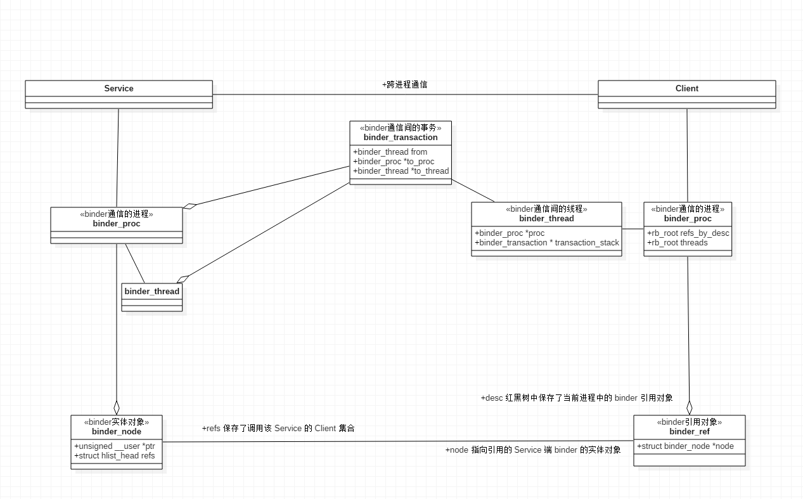


#### mmap系统调用
Binder 设备文件的mmap系统调用，binder_mmap
```C++
// drivers/staging/android/binder.c

// vm_area_struct 由 Linux 内核传入, 它表示一个进程的用户虚拟地址空间
static int binder_mmap(struct file *filp, struct vm_area_struct *vma)
{
	int ret;
	// 1. 声明一个 vm_struct 结构体 area, 它描述的是一个进程的内核态虚拟内存
	struct vm_struct *area;
	
	// 2. 从 binder 设备文件中获取 binder_proc, 当进程调用了 open 函数时, 便会创建一个 binder_proc
	struct binder_proc *proc = filp->private_data;
	struct binder_buffer *buffer;
	
    // 3. 判断要映射的用户虚拟地址空间范围是否超过了 4M
	if ((vma->vm_end - vma->vm_start) > SZ_4M)
		vma->vm_end = vma->vm_start + SZ_4M;// 若超过 4M, 则截断为 4M
    // 3.1 检查要映射的进程用户地址空间是否可写
	if (vma->vm_flags & FORBIDDEN_MMAP_FLAGS) {
		ret = -EPERM;
		failure_string = "bad vm_flags";
		goto err_bad_arg;// 若可写, 则映射失败
	}
	// 3.2 给 binder 用户地址的 flags 中添加一条不可复制的约定
	vma->vm_flags = (vma->vm_flags | VM_DONTCOPY) & ~VM_MAYWRITE;
    // 3.3 验证进程的 buffer 中, 是否已经指向一块内存区域了
	if (proc->buffer) {
		ret = -EBUSY;
		failure_string = "already mapped";
		goto err_already_mapped;// 若已存在内存区域, 则映射失败
	}
	
    // 4. 分配一块内核态的虚拟内存, 保存在 binder_proc 中
	area = get_vm_area(vma->vm_end - vma->vm_start, VM_IOREMAP);// 空间大小为用户地址空间的大小, 最大为 4M
	proc->buffer = area->addr;
	// 计算 binder 用户地址与内核地址的偏移量
	proc->user_buffer_offset = vma->vm_start - (uintptr_t)proc->buffer;
    ......
    
    // 5. 创建物理页面结构体指针数组, PAGE_SIZE 一般定义为 4k
	proc->pages = kzalloc(sizeof(proc->pages[0]) * ((vma->vm_end - vma->vm_start) / PAGE_SIZE), GFP_KERNEL);
    ......
    
    // 6. 调用 binder_update_page_range 给进程的(用户/内核)虚拟地址空间分配物理页面
	if (binder_update_page_range(proc, 1, proc->buffer, proc->buffer + PAGE_SIZE, vma)) {
		.......
	}
	
	// 7. 物理页面分配成功之后, 将这个内核缓冲区添加到进程结构体 proc 的内核缓冲区列表总
	buffer = proc->buffer;
	INIT_LIST_HEAD(&proc->buffers);// 初始化链表头
	list_add(&buffer->entry, &proc->buffers);// 添加到 proc 的内核缓冲区列表中
	......
	
	// 8. 将这个内核缓冲区添加到 proc 空闲内核缓冲区的红黑树 free_buffer 中
	binder_insert_free_buffer(proc, buffer);
	// 将该进程最大可用于执行异步事务的内核缓冲区大小设置为总大小的一半
	// 防止异步事务消耗过多内核缓冲区, 影响同步事务的执行
	proc->free_async_space = proc->buffer_size / 2;
    ......
	return 0;
    ......
}
```
binder_mmap为当前进程binder_proc初始化内核缓冲区，如下
- 验证是否满足创建条件
  - binder_mmap只有第一次调用有意义，已经初始化过直接返回失败
  - **一个进程的内核缓冲区最大为4M**
- 创建内核虚拟地址空间
- 物理页面的创建与映射
  - **将页面映射到用户虚拟地址空间和内核虚拟地址空间**
- 缓存缓冲区
  - 将初始化好的内核缓冲区 binder_buffer 保存到binder_proc中

##### 物理页面的创建与映射
在binder_mmap中，调用了binder_update_page_range分配内核缓冲区
```C++
// drivers/staging/android/binder.c

/**
 *  // binder_mmap 调用代码
	if (binder_update_page_range(proc, 1, proc->buffer, proc->buffer + PAGE_SIZE, vma)) {
		.......
	}
 */
static int binder_update_page_range(
                    struct binder_proc *proc,   // 描述当前进程的 binder 驱动管理者
                    int allocate,
				    void *start, void *end,     // 内核地址的起始 和 结束地址
				    struct vm_area_struct *vma  // 与内核地址映射的用户地址
				    )
{
	void *page_addr;
	unsigned long user_page_addr;
	struct vm_struct tmp_area;
	struct page **page;
    ......
    // 若该参数为 0, 则说明为释放内存, 显然这里为 1
	if (allocate == 0)
		goto free_range;
    ......
    // 分配物理内存
	for (page_addr = start; page_addr < end; page_addr += PAGE_SIZE) {
		int ret;
		struct page **page_array_ptr;
		// 1. 从进程的物理页面结构体指针数组 pages 中, 获取一个与内核地址空间 page_addr~(page_addr + PAGE_SIZE)对应的物理页面指针
		page = &proc->pages[(page_addr - proc->buffer) / PAGE_SIZE];
		// 2. 给结构体指针分配物理内存
		*page = alloc_page(GFP_KERNEL | __GFP_ZERO);
		......
		// 3. 将物理内存地址映射给 Linux 内核地址空间
		tmp_area.addr = page_addr;
		tmp_area.size = PAGE_SIZE + PAGE_SIZE /* guard page? */;
		page_array_ptr = page;
		ret = map_vm_area(&tmp_area, PAGE_KERNEL, &page_array_ptr);
		// 4. 将物理内存地址映射给 用户地址空间
		user_page_addr =
			(uintptr_t)page_addr + proc->user_buffer_offset;
		ret = vm_insert_page(vma, user_page_addr, page[0]);
	}
	......
	return 0;

free_range:
    // allocate 为 0 的情况, 释放物理内存的操作
}
```
Binder驱动为这块内核缓冲区，分配了一个物理页面（一般为4k）,这样数据从用户空间传递到内核空间时，就不用再用户态和内核态之间相互拷贝，只需要拷贝到虚拟地址指向的物理内存，就可以进行数据的读取

##### 缓存空闲缓存区
```C++
// drivers/staging/android/binder.c

static int binder_mmap(struct file *filp, struct vm_area_struct *vma)
{
	......
	// 将这个内核缓冲区添加到 proc 空闲内核缓冲区的红黑树 free_buffer 中
	binder_insert_free_buffer(proc, buffer);
    ......
}

static void binder_insert_free_buffer(struct binder_proc *proc,
				      struct binder_buffer *new_buffer)
{
    // 1. 获取进程中维护的空闲缓冲区列表
	struct rb_node **p = &proc->free_buffers.rb_node;
	struct rb_node *parent = NULL;
	struct binder_buffer *buffer;
	size_t buffer_size;
	size_t new_buffer_size;
    ......
    // 2. 计算新加入的内核缓冲区的大小
	new_buffer_size = binder_buffer_size(proc, new_buffer);
    ......
    // 3. 从红黑树中找寻合适的插入结点
	while (*p) {
		parent = *p;
		buffer = rb_entry(parent, struct binder_buffer, rb_node);
		buffer_size = binder_buffer_size(proc, buffer);
		if (new_buffer_size < buffer_size)
			p = &parent->rb_left;
		else
			p = &parent->rb_right;
	}
	// 4. 链入红黑树中
	rb_link_node(&new_buffer->rb_node, parent, p);
	rb_insert_color(&new_buffer->rb_node, &proc->free_buffers);
}
```
缓存内核缓冲区的操作，就是将这个binder_buffer 添加到binder_proc的红黑树中，方便后续使用，此时的空闲缓冲区是刚分配的。

还不太理解？
**最大缓冲区为4MB**，为什么只进行了一个物理页面的分配？
- Binder驱动采用了按需分配的策略，当需要进行数据拷贝时，会从空闲缓存区中找寻缓冲区，进行物理页面的映射，按需分配会降低Binder驱动闲置时的内存消耗。
  
**跨进程通信频繁时，4MB是否够用?**
对于大数据跨进程通信不够，需要使用共享内存的方式进行跨进程通信，Binder驱动是为了解决小规模跨进程通讯而生的

**跨进程共享内存 VS Binder驱动**
- 跨进程共享内存虽然可以进行大数据传输，但需要手动进行数据的读写的同步，几遍使用Android封装好的Asheme共享内存，成本也比较高
- 通过Binder驱动，可简化跨进程代码

#### ioctl系统调用

binder设备文件的ioctl系统调用是由binder_ioctl实现的
```C++
static long binder_ioctl(struct file *filp, unsigned int cmd, unsigned long arg)
{
	int ret;
	struct binder_proc *proc = filp->private_data;
	struct binder_thread *thread;
	unsigned int size = _IOC_SIZE(cmd);
	void __user *ubuf = (void __user *)arg;
	
	......
	
	ret = wait_event_interruptible(binder_user_error_wait, binder_stop_on_user_error < 2);
	if (ret)
		goto err_unlocked;

	binder_lock(__func__);
	
	// 2. 获取描述当前线程的 binder_thread 结构体
	thread = binder_get_thread(proc);
	......
	// IOCTL 请求码
	switch (cmd) {
	// 2.1 数据读写请求
	case BINDER_WRITE_READ:
		ret = binder_ioctl_write_read(filp, cmd, arg, thread);
		if (ret)
			goto err;
		break;
	......
	// 2.2 注册上下文的请求
	case BINDER_SET_CONTEXT_MGR:
		ret = binder_ioctl_set_ctx_mgr(filp);
		if (ret)
			goto err;
		ret = security_binder_set_context_mgr(proc->tsk);
		if (ret < 0)
			goto err;
		break;
	......
err:
	if (thread)
		thread->looper &= ~BINDER_LOOPER_STATE_NEED_RETURN;
	binder_unlock(__func__);
	wait_event_interruptible(binder_user_error_wait, binder_stop_on_user_error < 2);
	......
}
```
binder_ioctl主要负责处理用户空间传递的ioctl指令
- BINDER_WRITE_READ : 数据的读写
- BINDER_SET_CONTEXT_MGR : 注册Binder上下文的管理者


## Binder驱动 总结
Binder驱动程序设备文件的几个基础操作
- binder_init : 创建Binder驱动相关的文件
- binder_open : 打开binder设备文件，为当前进程创建binder_proc，可以理解为binder驱动上下文
  - binder_proc 对象
    - binder_node : 实体对象（服务端）
    - binder_ref : 引用对象（客户端）
  - binder_thread : binder线程
  - binder_buffer : binder缓冲区
- binder_mmap : 初始化当前进程第一个binder缓冲区binder_buffer,最大值为4MB
  - 只有首次调用有效（？）
  - 为缓冲区分配物理页面，将物理页映射到**用户虚拟地址**和**内核虚拟地址**
  -  将缓冲区添加到binder_proc中缓存
- binder_ioctl : 寻找空闲的线程，处理ioctl请求
  - BINDER_WRITE_READ : 数据的读写
  - BINDER_SET_CONTEXT_MGR : 注册Binder上下文的管理者（ServiceManager干的事）

# 8. Android 匿名共享内存

>Ashmem匿名共享内存是Android的Linux内核实现的一个驱动，它以驱动程序的形式实现在内核空间，用于进程间数据共享。

Binder内存缓冲区空间最大是4M，无法满足一次性大数据的传输，当AndroidUI渲染时，我们需要将待渲染的Surface数据发送到SurfaceFlinger进程进行绘制，就用到Ashmem。

## Ashmem 初始化

Ashmem的初始化是通过ashmen_init完成的
```C++
// kernel/goldfish/mm/ashmem.c
static struct kmem_cache *ashmem_area_cachep __read_mostly;

// Ashmem 驱动初始化
static int __init ashmem_init(void)
{
	int ret;
    // 创建了 kmem_cache, 用于分配 ashmem_area 结构体的内存
	ashmem_area_cachep = kmem_cache_create("ashmem_area_cache",
					  sizeof(struct ashmem_area),
					  0, 0, NULL);
    .......

	return 0;
}
```
通过kmem_cache_create函数创建了一个kmem_cache结构体对象。kmem_cache描述物理内存缓冲区，（内核中描述进程的task_struct也是通过kmem_cache来快速分配物理页面的）。

ashmem_cache的定义
```C++
// kernel/goldfish/mm/ashmem.c

#define ASHMEM_NAME_PREFIX "dev/ashmem/"
#define ASHMEM_NAME_PREFIX_LEN (sizeof(ASHMEM_NAME_PREFIX) - 1)
#define ASHMEM_FULL_NAME_LEN (ASHMEM_NAME_LEN + ASHMEM_NAME_PREFIX_LEN)

/**
 * ashmem_area - 描述一块共享内存区域的结构体
 * Lifecycle: From our parent file's open() until its release()
 * Locking: 受到 `ashmem_mutex' 互斥锁的保护
 * Big Note: Mappings do NOT pin this structure; it dies on close()
 */
struct ashmem_area {
    // 描述共享内存的名字, 名字会显示 /proc/<pid>/maps 文件中
    // pid 表示打开这个共享内存文件的进程ID
	char name[ASHMEM_FULL_NAME_LEN];
	
	// 描述一个链表头, 它把这块共享内存中所有被解锁的内存块连接在一起
	struct list_head unpinned_list;
	
	// 描述这个共享内存在临时文件系统 tmpfs 中对应的文件
	// 在内核决定要把这块共享内存对应的物理页面回收时，就会把它的内容交换到这个临时文件中去
	struct file *file;
	
	// 描述共享内存块的大小
	size_t size;		
	
	// 描述这块共享内存的访问保护位
	unsigned long prot_mask;	
};
```
## Ashmem open系统调用

```C++
// system/core/libcutils/ashmem-dev.cpp
static int __ashmem_open()
{
    int fd;

    pthread_mutex_lock(&__ashmem_lock);
    fd = __ashmem_open_locked();
    pthread_mutex_unlock(&__ashmem_lock);

    return fd;
}

#define ASHMEM_DEVICE "/dev/ashmem"

/* logistics of getting file descriptor for ashmem */
static int __ashmem_open_locked()
{
    ......
    // 调用了 open 函数获取文件描述符
    int fd = TEMP_FAILURE_RETRY(open(ASHMEM_DEVICE, O_RDWR | O_CLOEXEC));
    ......
    return fd;
}
```
我们在用户空间调用了open函数打开设备文件 ASHMEM_DEVICE 时，该设备文件的路径为 "/dev/ashmem"。最终会触发Linux内核中的ashmem_open的调用
```C++
// kernel/goldfish/mm/ashmem.c

#define ASHMEM_NAME_PREFIX "dev/ashmem/"
#define ASHMEM_NAME_PREFIX_LEN (sizeof(ASHMEM_NAME_PREFIX) - 1)

// 驱动初始化时, 创建的缓冲区
static struct kmem_cache *ashmem_area_cachep __read_mostly;

static int ashmem_open(struct inode *inode, struct file *file)
{
	struct ashmem_area *asma;
	......
    // 1. 通过 kmem_cache 创建一个 ashmem_area 结构体
	asma = kmem_cache_zalloc(ashmem_area_cachep, GFP_KERNEL);
	// 设置 ashmem_area 的其他字段
	// 初始化链表头
	INIT_LIST_HEAD(&asma->unpinned_list);
	// 给 name 属性设置固定前缀 "dev/ashmem/"
	memcpy(asma->name, ASHMEM_NAME_PREFIX, ASHMEM_NAME_PREFIX_LEN);
	......
	// 将结构体保存在设备文件的 private_data 中
	file->private_data = asma; 
	return 0;
}
```
ashmem_open主要完成：
- 通过kmem_cache创建一个ashmem_area结构体，用于描述这个ashmem共享内存
- 将这个Ashmem共享内存描述保存到设备文件的private_data中

## Ashmem mmap系统调用

ashmem_mmap函数的定义
```C++
// kernel/goldfish/mm/ashmem.c
static int ashmem_mmap(struct file *file, struct vm_area_struct *vma)
{
    // 1. 从这个驱动文件的 private_data 中获取 ashmem_area 结构体
	struct ashmem_area *asma = file->private_data;
	int ret = 0;

	mutex_lock(&ashmem_mutex);
    ......
    
	if (!asma->file) {
		char *name = ASHMEM_NAME_DEF;
		struct file *vmfile;

		if (asma->name[ASHMEM_NAME_PREFIX_LEN] != '\0')
			name = asma->name;

		// 2. 通过 shmem_file_setup 创建一个共享内存文件
		vmfile = shmem_file_setup(name, asma->size, vma->vm_flags);
		// 3. 将这个共享内存文件保存在 asma 对象中
		asma->file = vmfile;
	}
	get_file(asma->file);
    // 4. 将这个共享内存文件 映射到 用户的虚拟地址空间上
	if (vma->vm_flags & VM_SHARED)
		shmem_set_file(vma, asma->file);
	else {
		if (vma->vm_file)
			fput(vma->vm_file);
		vma->vm_file = asma->file;
	}
	......
	mutex_unlock(&ashmem_mutex);
	return ret;
}
```
ashmem_mmap 函数主要事情：
- 获取ashmem_area结构体对象（用于描述匿名共享内存）
- 通过ashmem_file_setup创建共享内存文件 vmfile
- 将创建的共享文件 vmfile 保存在 ashmem_area 的file内
- 将这个共享文件 映射到用户态的虚拟地址空间上
  
ashmem_mmap 操作完成后，用户空间就可以通过往文件中读写，从而将数据写入到共享内存文件中了

如何使用匿名共享内存？
Native端 参考MMKV 的 MemoryFile
```C++
#pragma mark - ashmem
#include "native-bridge.h"
#include <dlfcn.h>

#define ASHMEM_NAME_LEN 256
#define __ASHMEMIOC 0x77
#define ASHMEM_SET_NAME _IOW(__ASHMEMIOC, 1, char[ASHMEM_NAME_LEN])
#define ASHMEM_GET_NAME _IOR(__ASHMEMIOC, 2, char[ASHMEM_NAME_LEN])
#define ASHMEM_SET_SIZE _IOW(__ASHMEMIOC, 3, size_t)
#define ASHMEM_GET_SIZE _IO(__ASHMEMIOC, 4)

void *loadLibrary() {
    auto name = "libandroid.so";
    static auto handle = dlopen(name, RTLD_LAZY | RTLD_LOCAL);
    if (handle == RTLD_DEFAULT) {
        MMKVError("unable to load library %s", name);
    }
    return handle;
}

typedef int (*AShmem_create_t)(const char *name, size_t size);

int ASharedMemory_create(const char *name, size_t size) {
    int fd = -1;
    // Android 8.0 以上使用 libandroid.so 的 ASharedMemory_create 创建
    if (g_android_api >= __ANDROID_API_O__) {
        static auto handle = loadLibrary();
        static AShmem_create_t funcPtr =
            (handle != nullptr)
                ? reinterpret_cast<AShmem_create_t>(dlsym(handle, "ASharedMemory_create"))
                : nullptr;
        if (funcPtr) {
            fd = funcPtr(name, size);
            if (fd < 0) {
                MMKVError("fail to ASharedMemory_create %s with size %zu, errno:%s", name, size,
                          strerror(errno));
            }
        } else {
            MMKVWarning("fail to locate ASharedMemory_create() from loading libandroid.so");
        }
    }
    // Android 8.0 以下, 直接操作 "dev/ashmem" 驱动文件
    if (fd < 0) {
        fd = open(ASHMEM_NAME_DEF, O_RDWR);
        if (fd < 0) {
            MMKVError("fail to open ashmem:%s, %s", name, strerror(errno));
        } else {
            // 设置共享内存区域的名称
            if (ioctl(fd, ASHMEM_SET_NAME, name) != 0) {
                MMKVError("fail to set ashmem name:%s, %s", name, strerror(errno));
            } 
            // 设置共享内存区域的大小
            else if (ioctl(fd, ASHMEM_SET_SIZE, size) != 0) {
                MMKVError("fail to set ashmem:%s, size %zu, %s", name, size, strerror(errno));
            }
        }
    }
    return fd;
}
```  
因为文件是多个进程共享的，只要两个进程都通过mmap映射到这个文件，那么两个进程就可以通过共享内存进行通信了。

Java端 
```Java
// 创建 10 MB 的 Ashmem 共享内存
val memoryFile = MemoryFile("test shared memory", 10 * 1024 * 1024)

// 反射获取实现对象 mSharedMemory, 继承自 Parcelable
val sharedMemory = reflectObject(memoryFile, "mSharedMemory")

// 通过 Binder 驱动, 将 mSharedMemory 发送到另一个进程即可使用
```

## Ashmem 总结

Ashmem与Binder一样，都是通过驱动的形式存在于Linux内核中，Ashmem主要操作如下：
- init : 创建用于分配小内存的kmem_cache（有多大？），方便进行ashmem_area结构体的内存分配
- open : 打开驱动设备文件，创建ashmem_area描述一块匿名共享内存，将其保存到共享内存驱动 fd 的private中
- ioctl 
  - ASHMEM_SET_NAME : 为这块匿名共享内存设置文件名（只能在mmap之前调用）
  - ASHMEM_SET_SIZE : 为这块匿名共享内存设置文件大小 （只能在mmap之前调用）
- mmap
  - 创建一个基于内存文件系统的共享内存文件 vmfile
  - 将这个 vmfile 文件映射到用户空间的虚拟地址上


# 9. Android WindowManagerService 做了什么事情？
# 10. Android ActivityManagerService做了什么事情？
# 11. Android PackageManagerService做了什么事情？
 # 12. Android InputManagerService做了什么事情？
 # 13. Android 栈管理？
 # 14. Android ContextImpl都做了哪些事情？
 # 15. Android 的渲染机制是什么样的？如何绘制界面的？
 # 16. Android SurfaceView 和TextureView 的区别是什么？
 
 # 17. Android SurfaceView的双缓存机制是什么样的？
 # 18. Android SurfaceFlinger 原理是什么？
 # 19. Android 自定义View怎么实现？Canvas和Paint的使用方法？
 # 20. Android 的动画都有哪些，实现原理是什么？
 # 21. Android 热修复实现原理，即时生效和重启生效区别是什么？
 # 22. Android 组件化和插件化区别，分别怎么实现的？
 # 23. Android 常用的设计模式都有哪些？核心思想是什么？
 # 24. Android 如何加载一张大图？
 # 25. Android Bitmap的加载和缓存机制是什么？
 # 26. Android 如何实现一个图片加载框架？Glide的原理是什么？
 # 27. Android 网络请求是怎么实现的？OkHttp的原理是什么？
 # 28. Android RecyclerView的缓存机制是怎样的？
 # 29. Android ViewPager的加载机制与优化？
 # 30. Android Jetpack组件都有哪些？分别实现了哪些事情？
 # 31. Android 如何处理滑动冲突的？
 # 32. Android 如何处理崩溃？如何捕获异常？
 # 33. Android 如何进行性能调优？都做过哪些事情？
 # 34. Android 如何进行电量优化？Doze & Standby & Batter Historian &JobScheduler/WorkManager?
 # 35. Android Activity 和 Fragment的生命周期？
 # 36. Android ContentProvider原理是什么？
 # 37. Android Service的启动方法和区别？
 # 38. Android Activity 的启动模式是怎样的？
 # 39. Android Notification 的原理是什么？
 # 40. Android Mvp Mvvm Mvc 区别是什么？

MVC（Model/View/Controller）: 模型-视图-控制器
    Model: 通常模型对象负责在数据库中存取数据。
    View: 通常依据模型数据显示数据。
    Controller: 通常控制器负责从视图读取数据，控制用户输入，并向模型发送数据。

    优点: 视图层和业务层分离，耦合性低，逻辑简单。
    缺点: 控制器代码量过于庞大，MVC模式的逻辑大都集中在Controller中。

    Controller层是控制层，在Controller层会接收用户所有的操作，并根据逻辑触发Model层和View层。
    Controller层触发View层，并不会更新View层中的数据，View层中的数据是通过监听Model层数据的变化自动更新的，与Controller层无关
MVP（Model/View/Presenter）: 从MVC发展而来
    MVP中View层不能再直接访问Model层，必须通过Presenter层提供的接口，通过Presenter层来访问Model。

    优点: 模型与视图完成分离，修改视图不影响模型
    缺点: 对视图的渲染放在了Presenter中，View层与Model层的交互都需要经过Presenter层，定义的类比较多

MVVM（Model/View/ViewModel）
    VM是ViewModel层，ViewModel层把Model层和View层的数据同步自动化了，解决了MVP框架中数据同步比较麻烦的问题，
    ViewModel层双向绑定了View层和Model层，View层数据的变化会自动修改Model层数据，反之同理。
    - ViewModel的一个重要作用就是帮助Activity分担一部分工作，它是专门用于存放于界面相关的数据的，也就是说与界面上的数据相关的变量应该
    存放在ViewModel中，而不是Activity中。
    - ViewModel的声明周期与Activity不同，只有当Activity退出的时候，ViewModel才会销毁。
    MVP中的Presenter需要手动写方法来调用或修改View层和Model层。
    MVVM没有Controller层也没有Presenter层，有的是一个绑定器，绑定器在视图和模型之间通信。

    如何理解双向绑定？
    双向数据绑定是一个模板引擎，会根据数据的变化实时渲染，View层和Model层的修改会同步给对方。
   
    优点: 
        低耦合，视图可以独立于Model变化和修改，一个ViewModel可以绑定不同的View上。
        可重用性，可以把一些视图逻辑放在一个ViewModel中，让很多View重用这段视图逻辑。
        独立开发，开发人员可以专注于业务逻辑和数据的开发。


 # 41. Android 注解的应用？都有哪些注解？
 # 42. Android 数据库都有哪些？区别是什么？
 # 43. Android 如何实现推送功能？原理是什么？
 # 44. Android App瘦身都有哪些手段？

 so动态加载/插件化/代码压缩
 资源优化（svg）
 so缩包以及动态加载
shrinkResources 模式
res中raw中配置一个xml文件，keep.xml

    <resources
        tools:discard = "@layout/actity_main, @color/xxx.xml"
        tools:keep=""
        tools:shrinkMode = "safe">

        // keep : 保持某个文件
        // discard: 表示严格检查，
        // shrinkMode = strict 严格模式
        // shrinkMode = safe 安全模式

    </resource>
语种缩包
插件化缩包

<!-- generatedDensities =['xxhdpi'] -->
// 对矢量图处理
vectorDrawables.useSupportLibrary = true

 # 45. Android 如何保证安全性？都有哪些加固技术？
 # 46. Android 如何进行自动化测试？
 # 47. Android 如何实现强制下线功能？
 # 48. Android IntentService和HandleThread？
 # 49. Android 启动速度优化，冷热启动分别指什么？
 # 50. Android 如何进行卡顿分析？
 # 51. Android Systrace 和 TraceView 工具， StrictMode 严苛模式？
 # 52. Android 内存抖动的原因是什么？Profile检测工具、Mat大对象与泄露检测？
 # 53. Serializable和parcelable区别是什么？
 # 54. EventBus的原理是什么？
 # 55. 如何理解依赖注入？原理是什么？
 # 56. Flutter 的渲染机制是怎样的？
 # 57. Flutter 的核心思想是什么？
 # 58. Gradle 核心思想，自定一个AndroidStudio插件？
 # 59. Dalivk和Art虚拟机的区别是什么？
 # 60. HashMap的原理是什么？为什么不安全？
 # 61. LinkedHashMap的原理是什么？
 # 62. concurrentHash的原理是什么？
 # 63. Synchronize的原理是什么？怎么保证线安全的？
 # 64. ThreadLocal的原理是什么？
 # 65. ReentraintLock的原理是什么？
 # 66. Volatile关键字原理是什么？
 # 67. AQS和CAS原理是什么？CAS带来的ABA问题？
 # 68. RxJava的原理是什么？
 # 69. ARouter的原理是什么？
 # 70. Java 是如何加载一个类文件的？都有哪些方式加载？
 # 71. Class文件加载Dex原理？
 # 72. Java SPI机制实现组件服务调用？
 # 73. 如何实现动态代理？
 # 74. Java 虚拟机的运行时是怎么分布的？JMM的内存分布是什么？
 # 75. Java 垃圾回收机制的是什么？都有哪些垃圾回收的方法？
 
 # 76. Java的中引用方式？
 # 77. APT编译时注解的原理是什么？常见的都有哪些？
 # 78. Java线程池的工作原理？
 线程池是一种基于池化技术的思想来管理线程的工具，在线程池中维护了多个线程，通过对线程的复用，减少频繁创建和销毁线程的开销。
 线程池的分类：FixedThreadPool/CachedThreadPool/ScheduledThreadPool/SingleThreadExecutor
 线程池的基本用法
 ```Java
 // 创建线程的工厂
        ThreadFactory factory = new ThreadFactory() {
            final AtomicInteger count = new AtomicInteger();

            @Override
            public Thread newThread(@NotNull Runnable r) {
                return new Thread(r, "Thread #" + count.getAndIncrement());
            }
        };

        ThreadPoolExecutor executor = new ThreadPoolExecutor(
                // 核心线程数，默认情况下会一直存活，如果设置了allowCoreThreadTimeOut设置为true，由keepAliveTime控制
                3,
                // 线程池最大线程数，达到这个数值后，新任务会被阻塞
                10,
                // 默认指非核心线程的闲置超时时长
                60,
                TimeUnit.SECONDS,
                // 线程池的任务队列，通过线程池的execute方法提交的Runnable对象超过核心线程数后会存储在这个参数中
                new LinkedBlockingQueue<Runnable>(128),
                // 线程工厂
                factory
                // 还有rejectedExecutionHandler
        );

        // 运行一个新的线程
        executor.execute(()->{

        });

        // 线程池关闭
        executor.shutdown();
        executor.shutdownNow();

        // 测试1
        for (int i = 0; i < 3; i++) {
            executor.execute(()->{
                try {
                    while(true){
                        Thread.sleep(1000);
                        System.out.println("sleep 1000" + Thread.currentThread().getName());

                        // 此时队列中个数为0
                        System.out.println(executor.getQueue().size());
                    }
                } catch (InterruptedException e) {
                    e.printStackTrace();
                }
            });
        }

        // 测试2
        for (int i = 0; i < 4; i++) {
            executor.execute(()->{
                try {
                    while(true){
                        Thread.sleep(1000);
                        System.out.println("sleep 1000" + Thread.currentThread().getName());

                        // 此时队列中个数为1
                        System.out.println(executor.getQueue().size());
                    }
                } catch (InterruptedException e) {
                    e.printStackTrace();
                }
            });
        }

        // 测试3
        for (int i = 0; i < 14; i++) {
            executor.execute(()->{
                try {
                    while(true){
                        Thread.sleep(1000);
                        System.out.println("sleep 1000" + Thread.currentThread().getName());

                        // 此时队列中个数为11
                        System.out.println(executor.getQueue().size());
                    }
                } catch (InterruptedException e) {
                    e.printStackTrace();
                }
            });
        }
 ```

 # 79. Java线程都有哪些状态？
 线程6个状态：New / Runnable/ Blocked/ Waiting/ Timed_Waiting/ Terminated
 ```Java
 public enum State {
     // 未启动的状态
     NEW,     
     // 正在运行的状态          
     RUNNABLE,      
     // 正在等待一个monitor lock去进入一个synchronized块/方法或者重进入synchronize块在调用Object.wait方法后   
     BLOCKED,       
     // 调用后Object.wait (with no timeout)/ Thread.join (with no timeout)/ LockSupport.park后处于这个状态
     // 比如一个线程调用某个对象的Object.wait()，该对象正在等待其他线程调用该对象的Object.notify()/notifyAll()方法。
     // 或者一个线程调用Thread.join后正在等待指定线程的终结
     WAITING,          
     // 线程等待一个特定的时间，Thread.sleep / Object.wait(with timeout)/ Thread.join( with timeout)
     // LockSupport.parkNanos / LockSupport.parkUntil
     TIMED_WAITING,
     // 线程终结
     TERMINATED;
 }
 ```
 # 80. 使用过的并发库都有哪些？
 # 81. Java类的结构对象？
 # 82. Https和Http的区别是什么？
 # 83. Tcp/Ip协议的三次握手和四次挥手机制是什么？
 # 84. 项目中遇到过哪些问题？
 # 85. 如何进行换肤操作？
 # 86. 如何避免内存泄露？都有哪些场景？使用哪些工具？

 # 87. LeakCanary的原理是什么？
以LeakCanary 2.7 为例来讲解：
首先，什么是内存泄漏？
在Java运行环境中，内存泄漏指的是应用持有一个不再使用的对象引用，不对其进行释放。为该对象分配的内存无法被回收，最终会导致OOM。
LeakCanary工作步骤：
1. Detecting retained objects(检测存活的对象)
2. Dumping the heap (对堆内存进行保存处理)
3. Analyzing the heap (分析堆内存)
4. Categorizing leaks (对泄漏分类)

# Detecting retained objects
LeakCanary依赖Android的lifecycle来自动监测activities和fragments的destroyed方法调用时应该被垃圾收集器回收的情况。
这些要销毁的对象会被传给ObjectWatcher,ObjectWatcher持有这些对象的weak references。
LeakCanary可以自动检测以下对象：
- destroyed Activity instances
- destroyed Fragment instances
- destroyed fragment View instances
- cleared ViewModel instances

还可以通过调用watch方法来检测任何对象
AppWatcher.object.watch(myDetachedView, "View was detached")

如果ObjectWatcher持有的weakreference在运行gc后5秒没有被清除，这个被观察的对象仍然存活，那么可能存在内存泄漏。
# Dumping the heap
当保留的对象个数超过一定的阈值，LeakCanary会把java的堆内存dump到一个.hprof文件中
# Analyzing the heap
LeakCanary会使用Shark来解析hprof文件，定位存活的对象。
Shark是一个kotlin library，Shark为LeakCanary2提供内存分析器。
对于每一个retained对象，LeakCanary会寻找这个对象的引用路径，查看是哪里的引用阻止了其被回收。
# Categorizing leaks
LeakCanary 会把找到的泄漏分为两类：自身应用的和三方库的。


 # 88. Kotlin 如何理解函数式编程？
    函数式编程中一切皆函数。
    函数式编程的特点：
    1. 函数是第一等公民：把函数当成一种数据类型来使用，可以赋值给其他变量，可以当成参数传入另一个函数，也可以作为别的函数的返回值。
    2. 函数是纯函数：相同的输入总会得到相同的输出结果
    ```
    // 赋值
    var fun1 = function fun1(){}

    // 当成参数
    function func2(fn) {
        fn()
    }

    // 当成返回值使用
    function func3() {
        return function (){}
    }
    ```
 # 89. Kotlin 协程是什么？比线程有哪些优势？如何理解挂起的概念？
 # 90. Kotlin lambda编程？
 # 91. Kotlin 高阶函数？内联函数？
    ## 什么是高阶函数？
    - 函数作为参数被传递
    - 函数作为返回值输出

    ## 什么是内联函数？
    简单说，被inline标注后的函数，在调用它时，会把这个函数方法体中所有代码移动到调用的地方，而不是通过方法间的压栈进栈方式。
    也可理解为：在编译期间，把调用这个函数的地方用这个函数的方法体进行替换。

    inline在一般的方法上标注，并不会有很大的作用，inline能带来性能提升的，往往是在参数是lambda的函数上。
    ``` Java
    // 不建议使用inline
    private inline fun testInline() {
        print("test inline")
    }

    // 不建议使用inline
    private inline fun testInline(test: String) {
        print(test)
    }

    private fun test(body: () -> Unit) {
        testInline2(body)
    }
    // 建议使用inline
    private inline fun testInline2(block: () -> Unit) {
        block.invoke()
    }

    ```
    inline的使用规则是什么？
    - 不带参数，或者带有普通参数的函数，不建议使用inline
    - 带有lambda函数参数的函数，建议使用inline

    使用inline函数提升效率的原因？
    不适用inline的话，编译过程中，lambda参数会多出来类，会增加内存的分配。
    

 # 92. Kotlin DSL是什么？
 # 93. 如何理解Kotlin的属性委托？
 # 94. Kotlin的类都有哪些分类？区别是什么？
 # 95. 如何理解面向切面编程AOP？
 # 96. 微信MMKV原理与实现？
 # 97. SparseArray 和 ArrayMap 的好处是什么？
 # 98. 项目中遇到过哪些问题？怎样处理的？
 # 99. 如何理解SystemServer/SystemService/SystemServiceManager/ServiceManager的关系
 - ServiceManager是有init进程创建并启动的
   - 在SystemServer中启动的服务，在ServiceManager中注册的是用于进程间通信的
   - 而用于system_server进程内部通信的则注册到LocalServices中，LocalServices中都是静态方法。
   - （如AMS会把相关内部类的实例注册到LocalServices中，提供systemServer进程内部其他服务操作AMS接口，而给其他进程调用的接口封装成一个Binder类，注册到ServiceManager中）
 - SystemServer是一个final的类，是由Zynote进程fork出来的第一个进程。其中WMS和AMS等重要的可以binder通信的服务都运行在SystemServer进程中。AMS和WMS这些繁忙的服务运行在单独的线程中，不忙的服务并没有单独开一个线程，有些服务会注册到ServiceManager中。
 - SystemService是一个抽象类。这个抽象类有一个onStart的方法。
 - SystemServiceManager是一个创建、启动并管理实例的生命周期的类，这些实例必须实现SystemService接口。在SystemServer中调用SystemServiceManager的startService方法就是通过调用onStart方法来启动实例的。在SystemServiceManager中启动的服务，如果需要注册到ServiceManager中，则需要通过publishBinderService来完成。
  
  # 100. Kotlin 的also/with/apply/run/let 的区别是什么？
  - 这五个扩展函数无非就是接收者和返回值不同。
  - with/T.run/T.apply 接收者是this；T.let/T.also接收者是it
  - with/T.run/T.let 返回值是作用域最后一个对象this; T.apply/T.also返回值是调用者本身itself
  
  ## let /run /with 返回最后一行的值
  ``` 
  object.let {
      it.todo()   // 必须要使用it(名称可换), 最后一行为返回值类型
  }
  object?.let {
      it.todo()
  }
  ```
  ```
  with(object) {
      todo()     // 最后一行为返回值类型
  }
  ```
  ```
  object.run {
      todo()    // run是let和with的结合体
      result    // 返回最后一行代码的值
  }
  ```
  ## apply/also 返回对象本身
  ```
  object.apply { // 跟run不同的就是返回值不同
      todo()    // apply传入对象本身，返回值也是本身object
  }
  ```
  ```
  object.also {
      todo()   // 跟let不同的是返回值不一样，also返回的是本身object   
  }
  ```
  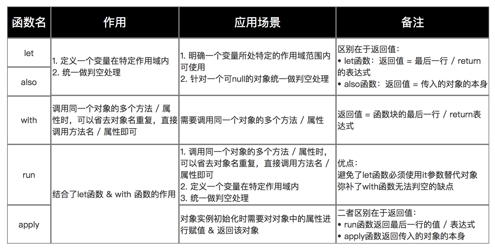

